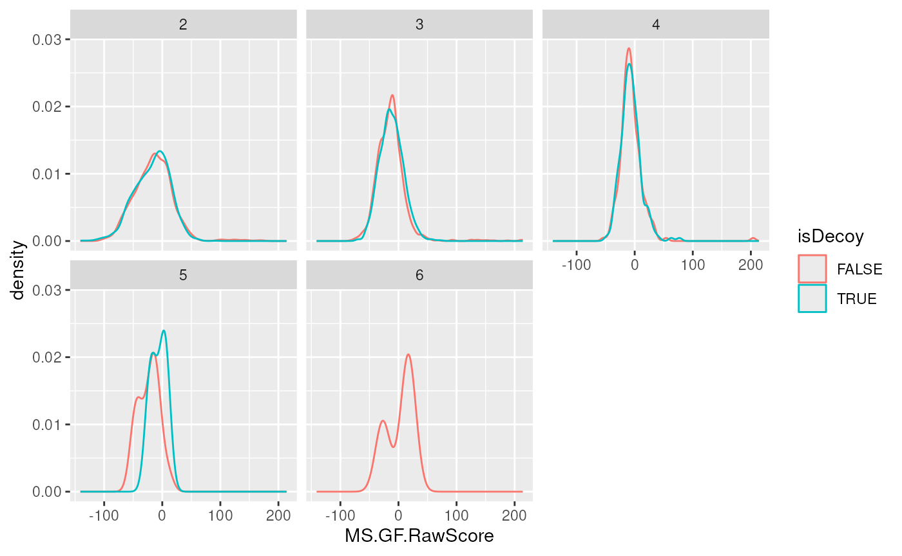
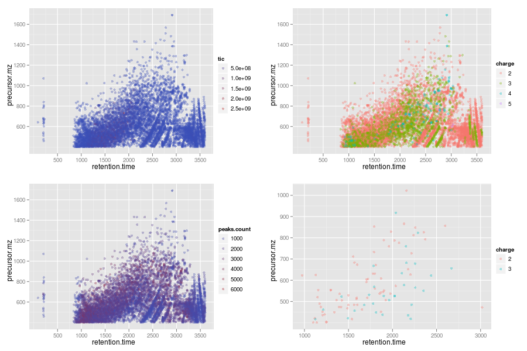
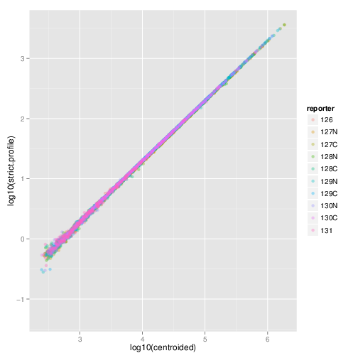

# MSnbase: MS data processing, visualisation and quantification

Abstract

This vignette describes the functionality implemented in the *MSnbase*
package. *MSnbase* aims at (1) facilitating the import, processing,
visualisation and quantification of mass spectrometry data into the R
environment (R Development Core Team 2011) by providing specific data
classes and methods and (2) enabling the utilisation of throughput-high
data analysis pipelines provided by the Bioconductor (Gentleman et al.
2004) project.

## Foreword

This software is free and open-source software. If you use it, please
support the project by citing it in publications:

> Gatto L, Lilley KS. MSnbase-an R/Bioconductor package for isobaric
> tagged mass spectrometry data visualization, processing and
> quantitation. Bioinformatics. 2012 Jan 15;28(2):288-9. doi:
> [10.1093/bioinformatics/btr645](https://doi.org/10.1093/bioinformatics/btr645).
> PMID: [22113085](https://www.ncbi.nlm.nih.gov/pubmed/22113085).

> *`MSnbase`, efficient and elegant R-based processing and visualisation
> of raw mass spectrometry data*. Laurent Gatto, Sebastian Gibb,
> Johannes Rainer. bioRxiv 2020.04.29.067868; doi:
> <https://doi.org/10.1101/2020.04.29.067868>

## Questions and bugs

For bugs, typos, suggestions or other questions, please file an issue in
our tracking system (<https://github.com/lgatto/MSnbase/issues>)
providing as much information as possible, a reproducible example and
the output of
[`sessionInfo()`](https://rdrr.io/r/utils/sessionInfo.html).

If you don’t have a GitHub account or wish to reach a broader audience
for general questions about proteomics analysis using R, you may want to
use the Bioconductor support site: <https://support.bioconductor.org/>.

## Introduction

*[MSnbase](https://bioconductor.org/packages/3.23/MSnbase)* (Gatto and
Lilley 2012) aims are providing a reproducible research framework to
proteomics data analysis. It should allow researcher to easily mine mass
spectrometry data, explore the data and its statistical properties and
visually display these.

*[MSnbase](https://bioconductor.org/packages/3.23/MSnbase)* also aims at
being compatible with the infrastructure implemented in Bioconductor, in
particular *[Biobase](https://bioconductor.org/packages/3.23/Biobase)*.
As such, classes developed specifically for proteomics mass spectrometry
data are based on the *eSet* and *ExpressionSet* classes. The main goal
is to assure seamless compatibility with existing meta data structure,
accessor methods and normalisation techniques.

This vignette illustrates
*[MSnbase](https://bioconductor.org/packages/3.23/MSnbase)* utility
using a dummy data sets provided with the package without describing the
underlying data structures. More details can be found in the package,
classes, method and function documentations. A description of the
classes is provided in the *MSnbase-development* vignette[^1].

### Speed and memory requirements

Raw mass spectrometry file are generally several hundreds of MB large
and most of this is used for binary raw spectrum data. As such, data
containers can easily grow very large and thus require large amounts of
RAM. This requirement is being tackled by avoiding to load the raw data
into memory and using on-disk random access to the content of
`mzXML`/`mzML` data files on demand. When focusing on reporter ion
quantitation, a direct solution for this is to trim the spectra using
the `trimMz` method to select the area of interest and thus
substantially reduce the size of the `Spectrum` objects. This is
illustrated in section @ref(sec:trim).

**Parallel processing** The independent handling of spectra is ideally
suited for parallel processing. The `quantify` method for example
performs reporter peaks quantitation in parallel.

Parallel support is provided by the
*[BiocParallel](https://bioconductor.org/packages/3.23/BiocParallel)*
and various backends including multicore (forking, default on Linux),
simple networf network of workstations (SNOW, default on Windows) using
sockets, forking or MPI among others. We refer readers to the
documentation in
*[BiocParallel](https://bioconductor.org/packages/3.23/BiocParallel)*.
Automatic parallel processing of spectra is only established for a
certain number of spectra (per file). This value (default is 1000) can
be set with the `setMSnbaseParallelThresh` function.

In sock-based parallel processing, the main worker process has to start
new R instances and connect to them via sock. Sometimes these
connections can not be established and the processes get stuck. To test
this, users can disable parallel processing by disabling parallel
processing with `register(SerialParam())`. To avoid these deadlocks, it
is possible to initiate the parallel processing setup explicitly at the
beginning of the script using, for example

``` r

library("doParallel")
registerDoParallel(3) ## using 3 slave nodes
register(DoparParam(), default = TRUE)

## rest of script comes below
```

**On-disk access** Developmenets in version 2 of the package have solved
the memory issue by implementing and *on-disk* version the of data class
storing raw data (*MSnExp*, see section @ref(sec:msnexp)), where the
spectra a accessed on-disk only when required. The *benchmarking*
vignette compares the on-disk and in-memory implemenatations[^2]. See
details below.

## Data structure and content

### Importing experiments

*[MSnbase](https://bioconductor.org/packages/3.23/MSnbase)* is able to
import raw MS data stored in one of the `XML`-based formats as well as
peak lists in the `mfg` format[^3].

**Raw data** The `XML`-based formats, `mzXML` (Pedrioli et al. 2004),
`mzData` (Orchard et al. 2007) and `mzML` (Martens et al. 2010) can be
imported with the `readMSData` function, as illustrated below (see
[`?readMSData`](https://lgatto.github.io/MSnbase/reference/readMSData.md)
for more details). To make use of the new *on-disk* implementation, set
`mode = "onDisk"` in `readMSData` rather than using the default
`mode = "inMemory"`.

``` r

file <- dir(system.file(package = "MSnbase", dir = "extdata"),
            full.names = TRUE, pattern = "mzXML$")
rawdata <- readMSData(file, msLevel. = 2, verbose = FALSE)
```

Only spectra of a given MS level can be loaded at a time by setting the
`msLevel` parameter accordingly in `readMSData` and *in-memory* data. In
this document, we will use the `itraqdata` data set, provided with
*[MSnbase](https://bioconductor.org/packages/3.23/MSnbase)*. It includes
feature metadata, accessible with the `fData` accessor. The metadata
includes identification data for the 55 MS2 spectra.

Version 2.0 and later of
*[MSnbase](https://bioconductor.org/packages/3.23/MSnbase)* provide a
new *on-disk* data storage model (see the *benchmarking* vignette for
more details). The new data backend is compatible with the orignal
*in-memory* model. To make use of the new infrastructure, read your raw
data by setting the `mode` argument to `"onDisk"` (the default is still
`"inMemory"` but is likely to change in the future). The new *on-disk*
implementation supports several MS levels in a single raw data object.
All existing operations work irrespective of the backend.

**Peak lists** can often be exported after spectrum processing from
vendor-specific software and are also used as input to search engines.
Peak lists in `mgf` format can be imported with the function
`readMgfData` (see
[`?readMgfData`](https://lgatto.github.io/MSnbase/reference/readMgfData.md)
for details) to create experiment objects. Experiments or individual
spectra can be exported to an `mgf` file with the `writeMgfData` methods
(see
[`?writeMgfData`](https://lgatto.github.io/MSnbase/reference/writeMgfData-methods.md)
for details and examples).

**Experiments with multiple runs** Although it is possible to load and
process multiple files serially and later merge the resulting
quantitation data as show in section @ref(sec:combine), it is also
feasible to load several raw data files at once. Here, we report the
analysis of an LC-MSMS experiment were 14 liquid chromatography (LC)
fractions were loaded in memory using `readMSData` on a 32-cores servers
with 128 Gb of RAM. It took about 90 minutes to read the 14 uncentroided
`mzXML` raw files (4.9 Gb on disk in total) and create a 3.3 Gb raw data
object (an *MSnExp* instance, see next section). Quantitation of 9
reporter ions (*iTRAQ9* object, see @ref(sec:reporterions)) for 88690
features was performed in parallel on 16 processors and took 76 minutes.
The resulting quantitation data was only 22.1 Mb and could easily be
further processed. These number are based on the older *in-memory*
implementation. As shown in the *benchmarking* vignette, using *on-disk*
data greatly reduces memory requirement and computation time.

See also section @ref(sec:io2) to import quantitative data stored in
spreadsheets into R for further processing using
*[MSnbase](https://bioconductor.org/packages/3.23/MSnbase)*. The
*MSnbase-io*vignette\[in R, open it with `vignette("MSnbase-io")` or
read it online
[here](https://bioconductor.org/packages/devel/bioc/vignettes/MSnbase/inst/doc/MSnbase-io.html)\]
gives a general overview of
*[MSnbase](https://bioconductor.org/packages/3.23/MSnbase)*’s
input/ouput capabilites.

See section @ref(sec:io3) for importing chromatographic data of SRM/MRM
experiments.

### Exporting experiments/MS data

`MSnbase` supports also to write `MSnExp` or `OnDiskMSnExp` objects to
`mzML` or `mzXML` files using the `writeMSData` function. This is
specifically useful in workflows in which the MS data was heavily
manipulated. Presently, each sample/file is exported into one file.

Below we write the data in `mzML` format to a temporary file. By setting
the optional parameter `copy = TRUE` general metadata (such as
instrument info or all data processing descriptions) are copied over
from the originating file.

``` r

writeMSData(rawdata, file = paste0(tempfile(), ".mzML"), copy = TRUE)
```

### MS experiments

Raw data is contained in *MSnExp* objects, that stores all the spectra
of an experiment, as defined by one or multiple raw data files.

``` r

library("MSnbase")
itraqdata
```

    ## MSn experiment data ("MSnExp")
    ## Object size in memory: 1.9 Mb
    ## - - - Spectra data - - -
    ##  MS level(s): 2 
    ##  Number of spectra: 55 
    ##  MSn retention times: 19:09 - 50:18 minutes
    ## - - - Processing information - - -
    ## Data loaded: Wed May 11 18:54:39 2011 
    ## Updated from version 0.3.0 to 0.3.1 [Fri Jul  8 20:23:25 2016] 
    ##  MSnbase version: 1.1.22 
    ## - - - Meta data  - - -
    ## phenoData
    ##   rowNames: 1
    ##   varLabels: sampleNames sampleNumbers
    ##   varMetadata: labelDescription
    ## Loaded from:
    ##   dummyiTRAQ.mzXML 
    ## protocolData: none
    ## featureData
    ##   featureNames: X1 X10 ... X9 (55 total)
    ##   fvarLabels: spectrum ProteinAccession ProteinDescription
    ##     PeptideSequence
    ##   fvarMetadata: labelDescription
    ## experimentData: use 'experimentData(object)'

``` r

head(fData(itraqdata))
```

    ##     spectrum ProteinAccession                       ProteinDescription
    ## X1         1              BSA                     bovine serum albumin
    ## X10       10          ECA1422 glucose-1-phosphate cytidylyltransferase
    ## X11       11          ECA4030         50S ribosomal subunit protein L4
    ## X12       12          ECA3882                   chaperone protein DnaK
    ## X13       13          ECA1364      succinyl-CoA synthetase alpha chain
    ## X14       14          ECA0871              NADP-dependent malic enzyme
    ##     PeptideSequence
    ## X1           NYQEAK
    ## X10 VTLVDTGEHSMTGGR
    ## X11           SPIWR
    ## X12        TAIDDALK
    ## X13          SILINK
    ## X14    DFEVVNNESDPR

As illustrated above, showing the experiment textually displays it’s
content:

- Information about the raw data, i.e. the spectra.

- Specific information about the experiment processing[^4] and package
  version. This slot can be accessed with the `processingData` method.

- Other meta data, including experimental phenotype, file name(s) used
  to import the data, protocol data, information about features
  (individual spectra here) and experiment data. Most of these are
  implemented as in the *eSet* class and are described in more details
  in their respective manual pages. See
  [`?MSnExp`](https://lgatto.github.io/MSnbase/reference/MSnExp-class.md)
  and references therein for additional background information.

  The experiment meta data associated with an *MSnExp* experiment is of
  class *MIAPE*. It stores general information about the experiment as
  well as MIAPE (Minimum Information About a Proteomics Experiment)
  information Taylor et al. (2008). This meta-data can be accessed with
  the `experimentData` method. When available, a summary of MIAPE-MS
  data can be printed with the `msInfo` method. See
  [`?MIAPE`](https://lgatto.github.io/MSnbase/reference/MIAPE-class.md)
  for more details.

### Spectra objects

The raw data is composed of the 55 MS spectra. The spectra are named
individually (X1, X10, X11, X12, X13, X14, …) and stored in a
`environment`. They can be accessed individually with
`itraqdata[["X1"]]` or `itraqdata[[1]]`, or as a list with
`spectra(itraqdata)`. As we have loaded our experiment specifying
`msLevel=2`, the spectra will all be of level 2 (or higher, if
available).

``` r

sp <- itraqdata[["X1"]]
sp
```

    ## Object of class "Spectrum2"
    ##  Precursor: 520.7833 
    ##  Retention time: 19:09 
    ##  Charge: 2 
    ##  MSn level: 2 
    ##  Peaks count: 1922 
    ##  Total ion count: 26413754

Attributes of individual spectra or of all spectra of an experiment can
be accessed with their respective methods: `precursorCharge` for the
precursor charge, `rtime` for the retention time, `mz` for the MZ
values, `intensity` for the intensities, … see the *Spectrum*,
*Spectrum1* and *Spectrum2* manuals for more details.

``` r

peaksCount(sp)
```

    ## [1] 1922

``` r

head(peaksCount(itraqdata))
```

    ##   X1  X10  X11  X12  X13  X14 
    ## 1922 1376 1571 2397 2574 1829

``` r

rtime(sp)
```

    ## [1] 1149.31

``` r

head(rtime(itraqdata))
```

    ##      X1     X10     X11     X12     X13     X14 
    ## 1149.31 1503.03 1663.61 1663.86 1664.08 1664.32

### Reporter ions

Reporter ions are defined with the *ReporterIons* class. Specific peaks
of interest are defined by a MZ value, a with around the expected MZ and
a name (and optionally a colour for plotting, see section
@ref(sec:plotting)). *ReporterIons* instances are required to quantify
reporter peaks in *MSnExp* experiments. Instances for the most commonly
used isobaric tags like iTRAQ 4-plex and 8-plex and TMT 6- and 10-plex
tags are already defined in
*[MSnbase](https://bioconductor.org/packages/3.23/MSnbase)*. See
[`?ReporterIons`](https://lgatto.github.io/MSnbase/reference/ReporterIons-class.md)
for details about how to generate new *ReporterIons* objects.

``` r

iTRAQ4
```

    ## Object of class "ReporterIons"
    ## iTRAQ4: '4-plex iTRAQ' with 4 reporter ions
    ##  - [iTRAQ4.114] 114.1112 +/- 0.05 (red)
    ##  - [iTRAQ4.115] 115.1083 +/- 0.05 (green)
    ##  - [iTRAQ4.116] 116.1116 +/- 0.05 (blue)
    ##  - [iTRAQ4.117] 117.115 +/- 0.05 (yellow)

``` r

TMT16
```

    ## Object of class "ReporterIons"
    ## TMT16HCD: '16-plex TMT HCD' with 16 reporter ions
    ##  - [126] 126.1277 +/- 0.002 (#E55400)
    ##  - [127N] 127.1248 +/- 0.002 (#E28100)
    ##  - [127C] 127.1311 +/- 0.002 (#DFAC00)
    ##  - [128N] 128.1281 +/- 0.002 (#DDD700)
    ##  - [128C] 128.1344 +/- 0.002 (#B5DA00)
    ##  - [129N] 129.1315 +/- 0.002 (#87D8000)
    ##  - [129C] 129.1378 +/- 0.002 (#5BD500)
    ##  - [130N] 130.1348 +/- 0.002 (#30D300)
    ##  - [130C] 130.1411 +/- 0.002 (#05D000)
    ##  - [131N] 131.1382 +/- 0.002 (#00CE23)
    ##  - [131C] 131.1445 +/- 0.002 (#00CB4B)
    ##  - [132N] 132.1415 +/- 0.002 (#00C972)
    ##  - [132C] 132.1479 +/- 0.002 (#00C699)
    ##  - [133N] 133.1449 +/- 0.002 (#00C4BE)
    ##  - [133C] 133.1512 +/- 0.002 (#00A0C1)
    ##  - [134N] 134.1482 +/- 0.002 (#0078BF)

### Chromatogram objects

Chromatographic data, i.e. intensity values along the retention time
dimension for a given $`m/z`$ range/slice, can be extracted with the
`chromatogram` method. Below we read a file from the `msdata` package
and extract the (MS level 1) chromatogram. Without providing an $`m/z`$
and a retention time range the function returns the total ion
chromatogram (TIC) for each file within the `MSnExp` or `OnDiskMSnExp`
object. See also section @ref(sec:io3) for importing chromatographic
data from SRM/MRM experiments.

``` r

f <- c(system.file("microtofq/MM14.mzML", package = "msdata"))
mtof <- readMSData(f, mode = "onDisk")
mtof_tic <- chromatogram(mtof)
mtof_tic
```

    ## MChromatograms with 1 row and 1 column
    ##           MM14.mzML
    ##      <Chromatogram>
    ## [1,]    length: 112
    ## phenoData with 1 variables
    ## featureData with 1 variables

Chromatographic data, represented by the intensity-retention time
duplets, is stored in the `Chromatogram` object. The `chromatogram`
method returns a `Chromatograms` object (note the *s*) which holds
multiple `Chromatogram` objects and arranges them in a two-dimensional
grid with columns representing files/samples of the `MSnExp` or
`OnDiskMSnExp` object and rows $`m/z`$-retention time ranges. In the
example above the `Chromatograms` object contains only a single
`Chromatogram` object. Below we access this chromatogram object. Similar
to the `Spectrum` objects, `Chromatogram` objects provide the accessor
functions `intensity` and `rtime` to access the data, as well as the
`mz` function, that returns the $`m/z`$ range of the chromatogram.

``` r

mtof_tic[1, 1]
```

    ## Object of class: Chromatogram
    ## Intensity values aggregated using: sum 
    ## length of object: 112
    ## from file: 1
    ## mz range: [94.80679, 1004.962]
    ## rt range: [270.334, 307.678]
    ## MS level: 1

``` r

head(intensity(mtof_tic[1, 1]))
```

    ## F1.S001 F1.S002 F1.S003 F1.S004 F1.S005 F1.S006 
    ##   64989   67445   77843  105097  155609  212760

``` r

head(rtime(mtof_tic[1, 1]))
```

    ## F1.S001 F1.S002 F1.S003 F1.S004 F1.S005 F1.S006 
    ## 270.334 270.671 271.007 271.343 271.680 272.016

``` r

mz(mtof_tic[1, 1])
```

    ## [1]   94.80679 1004.96155

To extract the base peak chromatogram (the largest peak along the
$`m/z`$ dimension for each retention time/spectrum) we set the
`aggregationFun` argument to `"max"`.

``` r

mtof_bpc <- chromatogram(mtof, aggregationFun = "max")
```

See the `Chromatogram` help page and the vignettes from the
*[xcms](https://bioconductor.org/packages/3.23/xcms)* package for more
details and use cases, also on how to extract chromatograms for specific
ions.

## Plotting raw data

### MS data space

The *MSmap* class can be used to isolate specific slices of interest
from a complete MS acquisition by specifying $`m/z`$ and retention time
ranges. One needs a raw data file in a format supported by
*[mzR](https://bioconductor.org/packages/3.23/mzR)*’s `openMSfile`
(`mzML`, `mzXML`, …). Below we first download a raw data file from the
PRIDE repository and create an *MSmap* containing all the MS1 spectra
between acquired between 30 and 35 minutes and peaks between 521 and 523
$`m/z`$. See
[`?MSmap`](https://lgatto.github.io/MSnbase/reference/MSmap-class.md)
for details.

``` r

## downloads the data
library("rpx")
px1 <- PXDataset("PXD000001")
mzf <- pxget(px1, 7)

## reads the data
ms <- openMSfile(mzf)
hd <- header(ms)

## a set of spectra of interest: MS1 spectra eluted
## between 30 and 35 minutes retention time
ms1 <- which(hd$msLevel == 1)
rtsel <- hd$retentionTime[ms1] / 60 > 30 &
    hd$retentionTime[ms1] / 60 < 35

## the map
M <- MSmap(ms, ms1[rtsel], 521, 523, .005, hd, zeroIsNA = TRUE)
```

``` r

M
```

    ## Object of class "MSmap"
    ##  Map [75, 401]
    ##   [1]  Retention time: 30:01 - 34:58 
    ##   [2]  M/Z: 521 - 523 (res 0.005)

The `M` map object can be rendered as a heatmap with `plot`, as shown on
figure @ref(fig:mapheat).

``` r

plot(M, aspect = 1, allTicks = FALSE)
```


Heat map of a chunk of the MS data.

One can also render the data in 3 dimension with the `plot3D` function,
as show on figure @ref(fig:map3d).

``` r

plot3D(M)
```


3 dimensional represention of MS map data.

To produce figure @ref(fig:map3d2), we create a second *MSmap* object
containing the first two MS1 spectra of the first map (object `M` above)
and all intermediate MS2 spectra and display $`m/z`$ values between 100
and 1000.

``` r

i <- ms1[which(rtsel)][1]
j <- ms1[which(rtsel)][2]
M2 <- MSmap(ms, i:j, 100, 1000, 1, hd)
```

``` r

M2
```

    ## Object of class "MSmap"
    ##  Map [12, 901]
    ##   [1]  Retention time: 30:01 - 30:05 
    ##   [2]  M/Z: 100 - 1000 (res 1)

``` r

plot3D(M2)
```


3 dimensional represention of MS map data. MS1 and MS2 spectra are
coloured in blue and magenta respectively.

### MS Spectra

Spectra can be plotted individually or as part of (subset) experiments
with the `plot` method. Full spectra can be plotted (using `full=TRUE`),
specific reporter ions of interest (by specifying with reporters with
`reporters=iTRAQ4` for instance) or both (see figure
@ref(fig:spectrumPlot)).

``` r

plot(sp, reporters = iTRAQ4, full = TRUE)
```


Raw MS2 spectrum with details about reporter ions.

It is also possible to plot all spectra of an experiment (figure
@ref(fig:msnexpPlot)). Lets start by subsetting the `itraqdata`
experiment using the protein accession numbers included in the feature
metadata, and keep the 6 from the *BSA* protein.

``` r

sel <- fData(itraqdata)$ProteinAccession == "BSA"
bsa <- itraqdata[sel]
bsa
```

    ## MSn experiment data ("MSnExp")
    ## Object size in memory: 0.11 Mb
    ## - - - Spectra data - - -
    ##  MS level(s): 2 
    ##  Number of spectra: 3 
    ##  MSn retention times: 19:09 - 36:17 minutes
    ## - - - Processing information - - -
    ## Data loaded: Wed May 11 18:54:39 2011 
    ## Updated from version 0.3.0 to 0.3.1 [Fri Jul  8 20:23:25 2016] 
    ## Data [logically] subsetted 3 spectra: Fri Apr 10 14:45:41 2026 
    ##  MSnbase version: 1.1.22 
    ## - - - Meta data  - - -
    ## phenoData
    ##   rowNames: 1
    ##   varLabels: sampleNames sampleNumbers
    ##   varMetadata: labelDescription
    ## Loaded from:
    ##   dummyiTRAQ.mzXML 
    ## protocolData: none
    ## featureData
    ##   featureNames: X1 X52 X53
    ##   fvarLabels: spectrum ProteinAccession ProteinDescription
    ##     PeptideSequence
    ##   fvarMetadata: labelDescription
    ## experimentData: use 'experimentData(object)'

``` r

as.character(fData(bsa)$ProteinAccession)
```

    ## [1] "BSA" "BSA" "BSA"

These can then be visualised together by plotting the *MSnExp* object,
as illustrated on figure @ref(fig:msnexpPlot).

``` r

plot(bsa, reporters = iTRAQ4, full = FALSE) + theme_gray(8)
```


Experiment-wide raw MS2 spectra. The y-axes of the individual spectra
are automatically rescaled to the same range. See section @ref(sec:norm)
to rescale peaks identically.

**Customising your plots** The
*[MSnbase](https://bioconductor.org/packages/3.23/MSnbase)* `plot`
methods have a logical `plot` parameter (default is `TRUE`), that
specifies if the plot should be printed to the current device. A plot
object is also (invisibly) returned, so that it can be saved as a
variable for later use or for customisation.

*[MSnbase](https://bioconductor.org/packages/3.23/MSnbase)* uses the
package to generate plots, which can subsequently easily be customised.
More details about can be found in (Wickham 2009) (especially chapter 8)
and on <http://had.co.nz/ggplot2/>. Finally, if a plot object has been
saved in a variable `p`, it is possible to obtain a summary of the
object with `summary(p)`. To view the data frame used to generate the
plot, use `p$data`.

### MS Chromatogram

Chromatographic data can be plotted using the `plot` method which, in
contrast to the `plot` method for `Spectrum` classes, uses R base
graphics. The `plot` method is implemented for `Chromatogram` and
`MChromatograms` classes. The latter plots all chromatograms for the
same $`m/z`$-rt range of all files in an experiment (i.e. for one row in
the `MChromatograms` object) into one plot.

``` r

plot(mtof_bpc)
```


Base peak chromatogram.

## Tandem MS identification data

Typically, identification data is produced by a search engine and
serialised to disk in the `mzIdentML` (or `mzid`) file format. This
format can be parsed by `openIDfile` from the
*[mzR](https://bioconductor.org/packages/3.23/mzR)* package or `mzID`
from the *[mzID](https://bioconductor.org/packages/3.23/mzID)* package.
The `MSnbase` package relies on the former (which is faster) and offers
a simplified interface by converting the dedicated identification data
objects into `data.frames`.

``` r

library("MsDataHub")
idf <- MsDataHub::TMT_Erwinia_1uLSike_Top10HCD_isol2_45stepped_60min_01.20141210.mzid()
```

    ## see ?MsDataHub and browseVignettes('MsDataHub') for documentation

    ## loading from cache

``` r

iddf <- readMzIdData(idf)
str(iddf)
```

    ## 'data.frame':    5802 obs. of  35 variables:
    ##  $ sequence                : chr  "RQCRTDFLNYLR" "ESVALADQVTCVDWRNRKATKK" "KELLCLAMQIIR" "QRMARTSDKQQSIRFLERLCGR" ...
    ##  $ spectrumID              : chr  "controllerType=0 controllerNumber=1 scan=2949" "controllerType=0 controllerNumber=1 scan=6534" "controllerType=0 controllerNumber=1 scan=5674" "controllerType=0 controllerNumber=1 scan=4782" ...
    ##  $ chargeState             : int  3 2 2 3 3 3 2 3 3 2 ...
    ##  $ rank                    : int  1 1 1 1 1 1 1 1 1 1 ...
    ##  $ passThreshold           : logi  TRUE TRUE TRUE TRUE TRUE TRUE ...
    ##  $ experimentalMassToCharge: num  548 1288 744 913 927 ...
    ##  $ calculatedMassToCharge  : num  548 1288 744 913 926 ...
    ##  $ peptideRef              : chr  "Pep77" "Pep108" "Pep136" "Pep163" ...
    ##  $ modNum                  : int  1 1 1 1 1 1 1 2 2 1 ...
    ##  $ isDecoy                 : logi  FALSE FALSE TRUE FALSE TRUE FALSE ...
    ##  $ post                    : chr  "V" "G" "Q" "D" ...
    ##  $ pre                     : chr  "R" "R" "R" "R" ...
    ##  $ start                   : int  574 69 131 182 135 310 182 201 201 121 ...
    ##  $ end                     : int  585 90 142 203 158 334 203 233 233 140 ...
    ##  $ DatabaseAccess          : chr  "ECA2006" "ECA1676" "XXX_ECA2855" "ECA3009" ...
    ##  $ DBseqLength             : int  1295 110 157 437 501 477 437 1204 1204 210 ...
    ##  $ DatabaseSeq             : chr  "" "" "" "" ...
    ##  $ DatabaseDescription     : chr  "ECA2006 ATP-dependent helicase" "ECA1676 putative growth inhibitory protein" "" "ECA3009 putative coproporphyrinogen oxidase" ...
    ##  $ scan.number.s.          : num  2949 6534 5674 4782 5839 ...
    ##  $ acquisitionNum          : num  2949 6534 5674 4782 5839 ...
    ##  $ spectrumFile            : chr  "TMT_Erwinia_1uLSike_Top10HCD_isol2_45stepped_60min_01-20141210.mzML" "TMT_Erwinia_1uLSike_Top10HCD_isol2_45stepped_60min_01-20141210.mzML" "TMT_Erwinia_1uLSike_Top10HCD_isol2_45stepped_60min_01-20141210.mzML" "TMT_Erwinia_1uLSike_Top10HCD_isol2_45stepped_60min_01-20141210.mzML" ...
    ##  $ idFile                  : chr  "681645275cbb_7857" "681645275cbb_7857" "681645275cbb_7857" "681645275cbb_7857" ...
    ##  $ MS.GF.RawScore          : num  10 12 8 -5 8 7 21 -31 -31 -3 ...
    ##  $ MS.GF.DeNovoScore       : num  101 121 74 160 241 214 196 165 165 59 ...
    ##  $ MS.GF.SpecEValue        : num  4.62e-08 7.26e-08 9.34e-08 1.27e-07 1.32e-07 ...
    ##  $ MS.GF.EValue            : num  0.132 0.209 0.267 0.366 0.379 ...
    ##  $ MS.GF.QValue            : num  0.525 0.61 0.625 0.717 0.736 ...
    ##  $ MS.GF.PepQValue         : num  0.549 0.623 0.636 0.724 0.745 ...
    ##  $ modPeptideRef           : chr  "Pep77" "Pep108" "Pep136" "Pep163" ...
    ##  $ modName                 : chr  "Carbamidomethyl" "Carbamidomethyl" "Carbamidomethyl" "Carbamidomethyl" ...
    ##  $ modMass                 : num  57 57 57 57 57 ...
    ##  $ modLocation             : int  3 11 5 20 20 21 20 1 28 4 ...
    ##  $ subOriginalResidue      : chr  NA NA NA NA ...
    ##  $ subReplacementResidue   : chr  NA NA NA NA ...
    ##  $ subLocation             : int  NA NA NA NA NA NA NA NA NA NA ...

The spectra along the rows are duplicated when the PSM can be assigned
to multiple proteins, such as

    ##                                         spectrumID    sequence DatabaseAccess
    ## 3794 controllerType=0 controllerNumber=1 scan=5291  RKAYLLRMRR    XXX_ECA2052
    ## 4886 controllerType=0 controllerNumber=1 scan=5291 ILLHPLRTLMR        ECA1281

of when there are multiple modifications in a PSM, such as

    ##                                        spectrumID
    ## 411 controllerType=0 controllerNumber=1 scan=4936
    ## 412 controllerType=0 controllerNumber=1 scan=4936
    ##                                    sequence         modName modLocation
    ## 411 ICSAILRIISPEWWGRKLWRLRCEWRENQFRAIGVIHKK Carbamidomethyl           2
    ## 412 ICSAILRIISPEWWGRKLWRLRCEWRENQFRAIGVIHKK Carbamidomethyl          23

At this stage, it is useful to perform some exploratory data analysis
and visualisation on the identification data. For example

``` r

table(iddf$isDecoy)
```

    ## 
    ## FALSE  TRUE 
    ##  2906  2896

``` r

table(iddf$chargeState)
```

    ## 
    ##    2    3    4    5    6 
    ## 3312 2064  400   23    3

``` r

library("ggplot2")
ggplot(data = iddf, aes(x = MS.GF.RawScore, colour = isDecoy)) +
    geom_density() +
    facet_wrap(~chargeState)
```



The `filterIdentificationDataFrame` function can be used to remove -
PSMs that match decoy entries - PSMs of rank \> 1 - PSMs that match
non-proteotypic proteins

``` r

iddf <- filterIdentificationDataFrame(iddf)
```

This `data.frame` can be now be further reduced so that individual rows
represent unique spectra, which can be done with the `reduce` method.

``` r

iddf2 <- reduce(iddf, key = "spectrumID")
```

This reduces the number of rows from 2710 to 2646.

The first duplicated spectrum mentioned above is now unique as is
matched a decoy protein that was filtered out with
`filterIdentificationDataFrame`.

    ##                                         spectrumID    sequence DatabaseAccess
    ## 1808 controllerType=0 controllerNumber=1 scan=5291 ILLHPLRTLMR        ECA1281

The matches to multiple modification in the same peptide are now
combined into a single row and documented as semicolon-separated values.

    ##                                         spectrumID
    ## 1659 controllerType=0 controllerNumber=1 scan=4936
    ##                                                                             sequence
    ## 1659 ICSAILRIISPEWWGRKLWRLRCEWRENQFRAIGVIHKK;ICSAILRIISPEWWGRKLWRLRCEWRENQFRAIGVIHKK
    ##                              modName modLocation
    ## 1659 Carbamidomethyl;Carbamidomethyl        2;23

This is the form that is used when combined to raw data, as described in
the next section.

### Adding identification data

*[MSnbase](https://bioconductor.org/packages/3.23/MSnbase)* is able to
integrate identification data from `mzIdentML` (Jones et al. 2012)
files.

We first load two example files shipped with the
*[MSnbase](https://bioconductor.org/packages/3.23/MSnbase)* containing
raw data (as above) and the corresponding identification results
respectively. The raw data is read with the `readMSData`, as
demonstrated above. As can be seen, the default feature data only
contain spectra numbers. More data about the spectra is of course
available in an *MSnExp* object, as illustrated in the previous
sections. See also
[`?pSet`](https://lgatto.github.io/MSnbase/reference/pSet-class.md) and
[`?MSnExp`](https://lgatto.github.io/MSnbase/reference/MSnExp-class.md)
for more details.

``` r

## find path to a mzXML file
quantFile <- dir(system.file(package = "MSnbase", dir = "extdata"),
                 full.names = TRUE, pattern = "mzXML$")
## find path to a mzIdentML file
identFile <- dir(system.file(package = "MSnbase", dir = "extdata"),
                 full.names = TRUE, pattern = "dummyiTRAQ.mzid")
## create basic MSnExp
msexp <- readMSData(quantFile, verbose = FALSE)
head(fData(msexp), n = 2)
```

    ##       spectrum
    ## F1.S1        1
    ## F1.S2        2

The `addIdentificationData` method takes an *MSnExp* instance (or an
*MSnSet* instance storing quantitation data, see section
@ref(sec:quant)) as first argument and one or multiple `mzIdentML` file
names (as a character vector) as second one[^5] and updates the *MSnExp*
feature data using the identification data read from the `mzIdentML`
file(s).

``` r

msexp <- addIdentificationData(msexp, id = identFile)
head(fData(msexp), n = 2)
```

    ##       spectrum acquisition.number          sequence chargeState rank
    ## F1.S1        1                  1 VESITARHGEVLQLRPK           3    1
    ## F1.S2        2                  2     IDGQWVTHQWLKK           3    1
    ##       passThreshold experimentalMassToCharge calculatedMassToCharge peptideRef
    ## F1.S1          TRUE                 645.3741               645.0375       Pep2
    ## F1.S2          TRUE                 546.9586               546.9633       Pep1
    ##       modNum isDecoy post pre start end DatabaseAccess DBseqLength DatabaseSeq
    ## F1.S1      0   FALSE    A   R   170 186        ECA0984         231            
    ## F1.S2      0   FALSE    A   K    50  62        ECA1028         275            
    ##                                                              DatabaseDescription
    ## F1.S1                                        ECA0984 DNA mismatch repair protein
    ## F1.S2 ECA1028 2,3,4,5-tetrahydropyridine-2,6-dicarboxylate N-succinyltransferase
    ##       scan.number.s.          idFile MS.GF.RawScore MS.GF.DeNovoScore
    ## F1.S1              1 dummyiTRAQ.mzid            -39                77
    ## F1.S2              2 dummyiTRAQ.mzid            -30                39
    ##       MS.GF.SpecEValue MS.GF.EValue modPeptideRef modName modMass modLocation
    ## F1.S1     5.527468e-05     79.36958          <NA>    <NA>      NA          NA
    ## F1.S2     9.399048e-06     13.46615          <NA>    <NA>      NA          NA
    ##       subOriginalResidue subReplacementResidue subLocation nprot npep.prot
    ## F1.S1               <NA>                  <NA>          NA     1         1
    ## F1.S2               <NA>                  <NA>          NA     1         1
    ##       npsm.prot npsm.pep
    ## F1.S1         1        1
    ## F1.S2         1        1

Finally we can use `idSummary` to summarise the percentage of identified
features per quantitation/identification pairs.

``` r

idSummary(msexp)
```

    ##       spectrumFile          idFile coverage
    ## 1 dummyiTRAQ.mzXML dummyiTRAQ.mzid      0.6

When identification data is present, and hence peptide sequences, one
can annotation fragment peaks on the MS2 figure by passing the peptide
sequence to the `plot` method.

``` r

itraqdata2 <- pickPeaks(itraqdata, verbose=FALSE)
i <- 14
s <- as.character(fData(itraqdata2)[i, "PeptideSequence"])
```

``` r

plot(itraqdata2[[i]], s, main = s)
```


Annotated MS2 spectrum.

The fragment ions are calculated with the `calculateFragments`,
described in section @ref(sec:calcfrag).

### Filtering identification data

One can remove the features that have not been identified using
`removeNoId`. This function uses by default the `pepseq` feature
variable to search the presence of missing data (`NA` values) and then
filter these non-identified spectra.

``` r

fData(msexp)$sequence
```

    ## [1] "VESITARHGEVLQLRPK" "IDGQWVTHQWLKK"     NA                 
    ## [4] NA                  "LVILLFR"

``` r

msexp <- removeNoId(msexp)
fData(msexp)$sequence
```

    ## [1] "VESITARHGEVLQLRPK" "IDGQWVTHQWLKK"     "LVILLFR"

``` r

idSummary(msexp)
```

    ##       spectrumFile          idFile coverage
    ## 1 dummyiTRAQ.mzXML dummyiTRAQ.mzid        1

Similarly, the `removeMultipleAssignment` method can be used to filter
out non-unique features, i.e. that have been assigned to protein groups
with more than one member. This function uses by default the `nprot`
feature variable.

Note that `removeNoId` and `removeMultipleAssignment` methods can also
be called on *MSnExp* instances.

### Calculate Fragments

*[MSnbase](https://bioconductor.org/packages/3.23/MSnbase)* is able to
calculate theoretical peptide fragments via `calculateFragments`.

``` r

calculateFragments("ACEK",
                   type = c("a", "b", "c", "x", "y", "z"))
```

    ## Fixed modifications used: C=57.02146
    ## Variable modifications used: None

    ##           mz ion type pos z seq         peptide
    ## 1   44.04947  a1    a   1 1   A AC[+57.02146]EK
    ## 2  204.08012  a2    a   2 1  AC AC[+57.02146]EK
    ## 3  333.12271  a3    a   3 1 ACE AC[+57.02146]EK
    ## 4   72.04439  b1    b   1 1   A AC[+57.02146]EK
    ## 5  232.07504  b2    b   2 1  AC AC[+57.02146]EK
    ## 6  361.11763  b3    b   3 1 ACE AC[+57.02146]EK
    ## 7   89.07094  c1    c   1 1   A AC[+57.02146]EK
    ## 8  249.10158  c2    c   2 1  AC AC[+57.02146]EK
    ## 9  378.14417  c3    c   3 1 ACE AC[+57.02146]EK
    ## 10 173.09207  x1    x   1 1   K AC[+57.02146]EK
    ## 11 302.13466  x2    x   2 1  EK AC[+57.02146]EK
    ## 12 462.16531  x3    x   3 1 CEK AC[+57.02146]EK
    ## 13 147.11280  y1    y   1 1   K AC[+57.02146]EK
    ## 14 276.15539  y2    y   2 1  EK AC[+57.02146]EK
    ## 15 436.18604  y3    y   3 1 CEK AC[+57.02146]EK
    ## 16 130.08625  z1    z   1 1   K AC[+57.02146]EK
    ## 17 259.12884  z2    z   2 1  EK AC[+57.02146]EK
    ## 18 419.15949  z3    z   3 1 CEK AC[+57.02146]EK
    ## 19 284.12409 x2_   x_   2 1  EK AC[+57.02146]EK
    ## 20 258.14483 y2_   y_   2 1  EK AC[+57.02146]EK
    ## 21 241.11828 z2_   z_   2 1  EK AC[+57.02146]EK
    ## 22 155.08150 x1_   x_   1 1   K AC[+57.02146]EK
    ## 23 444.15474 x3_   x_   3 1 CEK AC[+57.02146]EK
    ## 24 129.10224 y1_   y_   1 1   K AC[+57.02146]EK
    ## 25 418.17548 y3_   y_   3 1 CEK AC[+57.02146]EK
    ## 26 112.07569 z1_   z_   1 1   K AC[+57.02146]EK
    ## 27 401.14893 z3_   z_   3 1 CEK AC[+57.02146]EK

It is also possible to match these fragments against an *Spectrum2*
object.

``` r

pepseq <- fData(msexp)$sequence[1]
calculateFragments(pepseq, msexp[[1]], type=c("b", "y"))
```

    ## Fixed modifications used: C=57.02146
    ## Variable modifications used: None

    ##           mz  intensity  ion type pos z             seq       error
    ## 1   100.0005       0.00   b1    b   1 1               V  0.07522824
    ## 2   429.2563 1972344.00   b4    b   4 1            VESI -0.02189010
    ## 3   512.3044  684918.00  b5_   b_   5 1           VESIT -0.03290132
    ## 4   513.3047 2574137.00   y4    y   4 1            LRPK  0.04598246
    ## 5   583.3300 1440833.75  b6_   b_   6 1          VESITA -0.02142609
    ## 6   754.4504  537234.81   y6    y   6 1          LQLRPK  0.04293155
    ## 7   836.6139   82364.42  y7*   y*   7 1         VLQLRPK -0.07865960
    ## 8   982.5354  500159.06   y8    y   8 1        EVLQLRPK  0.06897061
    ## 9  1080.5867  209363.69  b10    b  10 1      VESITARHGE -0.04344392
    ## 10 1672.8380   76075.02 b15*   b*  15 1 VESITARHGEVLQLR  0.07488430
    ## 11 1688.0375  136748.83 y15*   y*  15 1 SITARHGEVLQLRPK -0.07729359

## Quality control

The current section is not executed dynamically for package size and
processing time constrains. The figures and tables have been generated
with the respective methods and included statically in the vignette for
illustration purposes.

*[MSnbase](https://bioconductor.org/packages/3.23/MSnbase)* allows easy
and flexible access to the data, which allows to visualise data features
to assess it’s quality. Some methods are readily available, although
many QC approaches will be experiment specific and users are encourage
to explore their data.

The `plot2d` method takes one *MSnExp* instance as first argument to
produce retention time *vs.* precursor MZ scatter plots. Points
represent individual MS2 spectra and can be coloured based on precursor
charge (with second argument `z="charge"`), total ion count
(`z="ionCount"`), number of peaks in the MS2 spectra `z="peaks.count"`)
or, when multiple data files were loaded, file `z="file"`), as
illustrated on the [next figure](#fig:plot2d). The lower right panel is
produced for only a subset of proteins. See the method documentation for
more details.



Illustration of the `plot2d` output.

The `plotDensity` method illustrates the distribution of several
parameters of interest (see [figure below](#fig:plotDensity)). Similarly
to `plot2d`, the first argument is an *MSnExp* instance. The second is
one of `precursor.mz`, `peaks.count` or `ionCount`, whose density will
be plotted. An optional third argument specifies whether the x axes
should be logged.


Illustration of the `plotDensity` output.

The `plotMzDelta` method[^6] implements the $`m/z`$ delta plot from
(Foster et al. 2011) The $`m/z`$ delta plot illustrates the suitability
of MS2 spectra for identification by plotting the $`m/z`$ differences of
the most intense peaks. The resulting histogram should optimally shown
outstanding bars at amino acid residu masses. More details and
parameters are described in the method documentation
([`?plotMzDelta`](https://lgatto.github.io/MSnbase/reference/plotMzDelta-methods.md)).
The [next figure](#fig:plotMzDelta) has been generated using the PRIDE
experiment 12011, as in (Foster et al. 2011).


Illustration of the `plotMzDelta` output for the PRIDE experiment 12011,
as in figure 4A from (Foster et al. 2011).

In section @ref(sec:incompdissoc), we illustrate how to assess
incomplete reporter ion dissociation.

## Raw data processing

### Cleaning spectra

There are several methods implemented to perform basic raw data
processing and manipulation. Low intensity peaks can be set to 0 with
the `removePeaks` method from spectra or whole experiments. The
intensity threshold below which peaks are removed is defined by the `t`
parameter. `t` can be specified directly as a numeric. The default value
is the character `"min"`, that will remove all peaks equal to the lowest
non null intensity in any spectrum. We observe the effect of the
`removePeaks` method by comparing total ion count (i.e. the total
intensity in a spectrum) with the `ionCount` method before (object
`itraqdata`) and after (object `experiment`) for spectrum `X55`. The
respective spectra are shown on figure @ref(fig:spectrum-clean-plot).

``` r

experiment <- removePeaks(itraqdata, t = 400, verbose = FALSE)
ionCount(itraqdata[["X55"]])
```

    ## [1] 555408.8

``` r

ionCount(experiment[["X55"]])
```

    ## [1] 499769.6


Same spectrum before (left) and after setting peaks \<= 400 to 0.

Unlike the name might suggest, the `removePeaks` method does not
actually remove peaks from the spectrum; they are set to 0. This can be
checked using the `peaksCount` method, that returns the number of peaks
(including 0 intensity peaks) in a spectrum. To effectively remove 0
intensity peaks from spectra, and reduce the size of the data set, one
can use the `clean` method. The effect of the `removePeaks` and `clean`
methods are illustrated on figure @ref(fig:preprocPlot).

``` r

peaksCount(itraqdata[["X55"]])
```

    ## [1] 1726

``` r

peaksCount(experiment[["X55"]])
```

    ## [1] 1726

``` r

experiment <- clean(experiment, verbose = FALSE)
peaksCount(experiment[["X55"]])
```

    ## [1] 440

![This figure illustrated the effect or the \`removePeaks\` and
\`clean\` methods. The left-most spectrum displays two peaks, of max
height 3 and 7 respectively. The middle spectrum shows the result of
calling \`removePeaks\` with argument \`t=3\`, which sets all data
points of the first peak, whose maximum height is smaller or equal to
\`t\` to 0. The second peak is unaffected. Calling \`clean\` after
\`removePeaks\` effectively deletes successive 0 intensities from the
spectrum, as shown on the right
plot.](v01-MSnbase-demo_files/figure-html/preprocPlot-1.png)

This figure illustrated the effect or the `removePeaks` and `clean`
methods. The left-most spectrum displays two peaks, of max height 3 and
7 respectively. The middle spectrum shows the result of calling
`removePeaks` with argument `t=3`, which sets all data points of the
first peak, whose maximum height is smaller or equal to `t` to 0. The
second peak is unaffected. Calling `clean` after `removePeaks`
effectively deletes successive 0 intensities from the spectrum, as shown
on the right plot.

### Focusing on specific MZ values

Another useful manipulation method is `trimMz`, that takes as parameters
and *MSnExp* (or a *Spectrum*) and a numeric `mzlim`. MZ values smaller
then `min(mzlim)` or greater then `max(mzmax)` are discarded. This
method is particularly useful when one wants to concentrate on a
specific MZ range, as for reporter ions quantification, and generally
results in substantial reduction of data size. Compare the size of the
full trimmed experiment to the original 1.9 Mb.

``` r

range(mz(itraqdata[["X55"]]))
```

    ## [1] 100.0002 977.6636

``` r

experiment <- filterMz(experiment, mzlim = c(112,120))
range(mz(experiment[["X55"]]))
```

    ## [1] 102.0612 473.3372

``` r

experiment
```

    ## MSn experiment data ("MSnExp")
    ## Object size in memory: 1.18 Mb
    ## - - - Spectra data - - -
    ##  MS level(s): 2 
    ##  Number of spectra: 55 
    ##  MSn retention times: 19:09 - 50:18 minutes
    ## - - - Processing information - - -
    ## Data loaded: Wed May 11 18:54:39 2011 
    ## Updated from version 0.3.0 to 0.3.1 [Fri Jul  8 20:23:25 2016] 
    ## Curves <= 400 set to '0': Fri Apr 10 14:45:50 2026 
    ## Spectra cleaned: Fri Apr 10 14:45:50 2026 
    ##  MSnbase version: 1.1.22 
    ## - - - Meta data  - - -
    ## phenoData
    ##   rowNames: 1
    ##   varLabels: sampleNames sampleNumbers
    ##   varMetadata: labelDescription
    ## Loaded from:
    ##   dummyiTRAQ.mzXML 
    ## protocolData: none
    ## featureData
    ##   featureNames: X1 X10 ... X9 (55 total)
    ##   fvarLabels: spectrum ProteinAccession ProteinDescription
    ##     PeptideSequence
    ##   fvarMetadata: labelDescription
    ## experimentData: use 'experimentData(object)'

As can be seen above, all processing performed on the experiment is
recorded and displayed as integral part of the experiment object.

### Spectrum processing

*MSnExp* and *Spectrum2* instances also support standard MS data
processing such as smoothing and peak picking, as described in the
`smooth` and `pickPeak` manual pages. The methods that either single
spectra of experiments, process the spectrum/spectra, and return a
updated, processed, object. The implementations originate from the
package (Gibb and Strimmer 2012).

## MS2 isobaric tagging quantitation

### Reporter ions quantitation

Quantitation is performed on fixed peaks in the spectra, that are
specified with an *ReporterIons* object. A specific peak is defined by
it’s expected `mz` value and is searched for within `mz` $`\pm`$`width`.
If no data is found, `NA` is returned.

``` r

mz(iTRAQ4)
```

    ## [1] 114.1112 115.1083 116.1116 117.1150

``` r

width(iTRAQ4)
```

    ## [1] 0.05

The `quantify` method takes the following parameters: an *MSnExp*
experiment, a character describing the quantification `method`, the
`reporters` to be quantified and a `strict` logical defining whether
data points ranging outside of `mz` $`\pm`$`width` should be considered
for quantitation. Additionally, a progress bar can be displaying when
setting the `verbose` parameter to `TRUE`. Three quantification methods
are implemented, as illustrated on figure @ref(fig:quantitationPlot).
Quantitation using `sum` sums all the data points in the peaks to
produce, for this example, 7, whereas method `max` only uses the peak’s
maximum intensity, 3. `Trapezoidation` calculates the area under the
peak taking the full with into account (using `strict = FALSE` gives
0.375) or only the width as defined by the reporter (using
`strict = TRUE` gives 0.1). See
[`?quantify`](https://lgatto.github.io/MSnbase/reference/quantify-methods.md)
for more details.

    ## Warning in geom_point(aes(x = 114.1, y = 3), alpha = I(1/18), colour = "red", : All aesthetics have length 1, but the data has 7 rows.
    ## ℹ Please consider using `annotate()` or provide this layer with data containing
    ##   a single row.


The different quantitation methods. See text for details.

The `quantify` method returns *MSnSet* objects, that extend the
well-known *eSet* class defined in the
*[Biobase](https://bioconductor.org/packages/3.23/Biobase)* package.
*MSnSet* instances are very similar to *ExpressionSet* objects, except
for the experiment meta-data that captures MIAPE specific information.
The assay data is a matrix of dimensions $`n
\times m`$, where $`m`$ is the number of features/spectra originally in
the *MSnExp* used as parameter in `quantify` and $`m`$ is the number of
reporter ions, that can be accessed with the `exprs` method. The meta
data is directly inherited from the *MSnExp* instance.

``` r

qnt <- quantify(experiment,
                method = "trap",
                reporters = iTRAQ4,
                strict = FALSE,
                verbose = FALSE)
qnt
```

    ## MSnSet (storageMode: lockedEnvironment)
    ## assayData: 55 features, 4 samples 
    ##   element names: exprs 
    ## protocolData: none
    ## phenoData
    ##   sampleNames: iTRAQ4.114 iTRAQ4.115 iTRAQ4.116 iTRAQ4.117
    ##   varLabels: mz reporters
    ##   varMetadata: labelDescription
    ## featureData
    ##   featureNames: X1 X10 ... X9 (55 total)
    ##   fvarLabels: spectrum ProteinAccession ... collision.energy (15 total)
    ##   fvarMetadata: labelDescription
    ## experimentData: use 'experimentData(object)'
    ## Annotation: No annotation 
    ## - - - Processing information - - -
    ## Data loaded: Wed May 11 18:54:39 2011 
    ## Updated from version 0.3.0 to 0.3.1 [Fri Jul  8 20:23:25 2016] 
    ## Curves <= 400 set to '0': Fri Apr 10 14:45:50 2026 
    ## Spectra cleaned: Fri Apr 10 14:45:50 2026 
    ## iTRAQ4 quantification by trapezoidation: Fri Apr 10 14:45:52 2026 
    ##  MSnbase version: 1.1.22

``` r

head(exprs(qnt))
```

    ##     iTRAQ4.114 iTRAQ4.115 iTRAQ4.116 iTRAQ4.117
    ## X1   1347.6158  2247.3097  3927.6931  7661.1463
    ## X10   739.9861   799.3501   712.5983   940.6793
    ## X11 27638.3582 33394.0252 32104.2879 26628.7278
    ## X12 31892.8928 33634.6980 37674.7272 37227.7119
    ## X13 26143.7542 29677.4781 29089.0593 27902.5608
    ## X14  6448.0829  6234.1957  6902.8903  6437.2303

The [next figure](#fig:tmt10) illustrates the quantitation of the TMT
10-plex isobaric tags using the `quantify` method and the `TMT10`
reporter instance. The data on the $`x`$ axis has been quantified using
`method = "max"` and centroided data (as generated using ProteoWizard’s
`msconvert` with vendor libraries’ peak picking); on the $`y`$ axis, the
quantitation method was `trapezoidation` and `strict = TRUE` (that’s
important for TMT 10-plex) and the profile data. We observe a very good
correlation.



TMT 10-plex quantitation.

If no peak is detected for a reporter ion peak, the respective
quantitation value is set to `NA`. In our case, there is 1 such case in
row 41. We will remove the offending line using the `filterNA` method.
The `pNA` argument defines the percentage of accepted missing values per
feature. As we do not expect any missing peaks, we set it to be 0 (which
is also the detault value).

``` r

table(is.na(qnt))
```

    ## 
    ## FALSE  TRUE 
    ##   219     1

``` r

qnt <- filterNA(qnt, pNA = 0)
sum(is.na(qnt))
```

    ## [1] 0

The filtering criteria for `filterNA` can also be defined as a pattern
of columns that can have missing values and columns that must not
exhibit any. See
[`?filterNA`](https://lgatto.github.io/MSnbase/reference/MSnSet-class.md)
for details and examples.

The infrastructure around the *MSnSet* class allows flexible filtering
using the `[` sub-setting operator. Below, we mimic the behaviour of
`filterNA(, pNA = 0)` by calculating the row indices that should be
removed, i.e. those that have at least one `NA` value and explicitly
remove these rows. This method allows one to devise and easily apply any
filtering strategy.

``` r

whichRow <- which(is.na((qnt))) %% nrow(qnt)
qnt <- qnt[-whichRow, ]
```

See also the `plotNA` method to obtain a graphical overview of the
completeness of a data set.

### Importing quantitation data

If quantitation data is already available as a spreadsheet, it can be
imported, along with additional optional feature and sample (pheno) meta
data, with the `readMSnSet` function. This function takes the respective
text-based spreadsheet (comma- or tab-separated) file names as argument
to create a valid *MSnSet* instance.

Note that the quantitation data of *MSnSet* objects can also be exported
to a text-based spreadsheet file using the `write.exps` method.

*[MSnbase](https://bioconductor.org/packages/3.23/MSnbase)* also
supports the `mzTab` format, a light-weight, tab-delimited file format
for proteomics data. `mzTab` files can be read into R with
`readMzTabData` to create and *MSnSet* instance.

See the *MSnbase-io* vignette for a general overview of
*[MSnbase](https://bioconductor.org/packages/3.23/MSnbase)*’s
input/ouput capabilites.

### Importing chromatographic data from SRM/MRM experiments

Data from SRM/MRM experiments can be imported from `mzML` files using
the `readSRMData` function. The `mzML` files are expected to contain
chromatographic data for the same precursor and product m/z values. The
function returns a `MChromatograms` object that arranges the data in a
two-dimensional array, each column representing the data of one file
(sample) and each row the chromatographic data for the same polarity,
precursor and product m/z. In the example code below we load a single
SRM file using `readSRMData`.

``` r

fl <- proteomics(full.names = TRUE, pattern = "MRM")
srm <- readSRMData(fl)

srm
```

    ## MChromatograms with 137 rows and 1 column
    ##                     1
    ##        <Chromatogram>
    ## [1,]      length: 523
    ## [2,]      length: 523
    ## ...              ... 
    ## [136,]    length: 962
    ## [137,]    length: 962
    ## phenoData with 1 variables
    ## featureData with 10 variables

The precursor and product m/z values can be extracted with the
`precursorMz` and `productMz` functions. These functions always return a
matrix, each row providing the lower and upper m/z value of the
isolation window (in most cases minimal and maximal m/z will be
identical).

``` r

head(precursorMz(srm))
```

    ##      mzmin mzmax
    ## [1,]   115   115
    ## [2,]   115   115
    ## [3,]   117   117
    ## [4,]   117   117
    ## [5,]   133   133
    ## [6,]   133   133

``` r

head(productMz(srm))
```

    ##        mzmin   mzmax
    ## [1,]  26.996  26.996
    ## [2,]  70.996  70.996
    ## [3,]  72.996  72.996
    ## [4,]  98.996  98.996
    ## [5,] 114.996 114.996
    ## [6,]  70.996  70.996

### Peak adjustments

**Single peak adjustment** In certain cases, peak intensities need to be
adjusted as a result of peak interferance. For example, the $`+1`$ peak
of the phenylalanine (F, Phe) immonium ion (with $`m/z`$ 120.03)
inteferes with the 121.1 TMT reporter ion. Below, we calculate the
relative intensity of the +1 peaks compared to the main peak using the
*[Rdisop](https://bioconductor.org/packages/3.23/Rdisop)* package.

``` r

library(Rdisop)
## Phenylalanine immonium ion
Fim <- getMolecule("C8H10N")
getMass(Fim)
```

    ## [1] 120.0813

``` r

isotopes <- getIsotope(Fim)
F1 <- isotopes[[1]][2, 2]
F1
```

    ## [1] 0.08339707

If desired, one can thus specifically quantify the F immonium ion in the
MS2 spectrum, estimate the intensity of the +1 ion (0.0834% of the F
peak) and substract this calculated value from the 121.1 TMT reporter
intensity.

The above principle can also be generalised for a set of overlapping
peaks, as described below.

**Reporter ions purity correction** Impurities in the reporter reagents
can also bias the results and can be corrected when manufacturers
provide correction coefficients. These generally come as percentages of
each reporter ion that have masses differing by -2, -1, +1 and +2 Da
from the nominal reporter ion mass due to isotopic variants. The
`purityCorrect` method applies such correction to *MSnSet* instances. It
also requires a square matrix as second argument, `impurities`, that
defines the relative percentage of reporter in the quantified each peak.
See
[`?purityCorrect`](https://lgatto.github.io/MSnbase/reference/purityCorrect-methods.md)
for more details.

``` r

impurities <- matrix(c(0.929, 0.059, 0.002, 0.000,
                       0.020, 0.923, 0.056, 0.001,
                       0.000, 0.030, 0.924, 0.045,
                       0.000, 0.001, 0.040, 0.923),
                     nrow = 4)
qnt.crct <- purityCorrect(qnt, impurities)
head(exprs(qnt))
```

    ##     iTRAQ4.114 iTRAQ4.115 iTRAQ4.116 iTRAQ4.117
    ## X1   1347.6158  2247.3097  3927.6931  7661.1463
    ## X10   739.9861   799.3501   712.5983   940.6793
    ## X11 27638.3582 33394.0252 32104.2879 26628.7278
    ## X12 31892.8928 33634.6980 37674.7272 37227.7119
    ## X13 26143.7542 29677.4781 29089.0593 27902.5608
    ## X14  6448.0829  6234.1957  6902.8903  6437.2303

``` r

head(exprs(qnt.crct))
```

    ##     iTRAQ4.114 iTRAQ4.115 iTRAQ4.116 iTRAQ4.117
    ## X1   1304.7675  2168.1082  3784.2244  8133.9211
    ## X10   743.8159   806.5647   696.9024   988.0787
    ## X11 27547.6515 33592.3997 32319.1803 27413.1833
    ## X12 32127.1898 33408.8353 37806.0787 38658.7865
    ## X13 26187.3141 29788.6254 29105.2485 28936.6871
    ## X14  6533.1862  6184.1103  6945.2074  6666.5633

The `makeImpuritiesMatrix` can be used to create impurity matrices. It
opens a rudimentary spreadsheet that can be directly edited.

## Processing quantitative data

### Data imputation

A set of imputation methods are available in the `impute` method: it
takes an *MSnSet* instance as input, the name of the imputation method
to be applied (one of bpca, knn, QRILC, MLE, MLE2, MinDet, MinProb, min,
zero, mixed, nbavg, with, RF, none), possible additional parameters and
returns an updated for *MSnSet* without any missing values. Below, we
apply a deterministic minimum value imputation on the `naset` example
data:

``` r

## an example MSnSet containing missing values
data(naset)
table(is.na(naset))
```

    ## 
    ## FALSE  TRUE 
    ## 10254   770

``` r

## number of NAs per protein
table(fData(naset)$nNA)
```

    ## 
    ##   0   1   2   3   4   8   9  10 
    ## 301 247  91  13   2  23  10   2

``` r

x <- impute(naset, "min")
processingData(x)
```

    ## - - - Processing information - - -
    ## Data imputation using min Fri Apr 10 14:45:54 2026 
    ##  MSnbase version: 1.15.6

``` r

table(is.na(x))
```

    ## 
    ## FALSE 
    ## 11024

As described in more details in (Lazar et al. 2016), there are two types
of mechanisms resulting in missing values in LC/MSMS experiments.

- Missing values resulting from absence of detection of a feature,
  despite ions being present at detectable concentrations. For example
  in the case of ion suppression or as a result from the stochastic,
  data-dependent nature of the MS acquisition method. These missing
  value are expected to be randomly distributed in the data and are
  defined as *missing at random* (MAR) or *missing completely at random*
  (MCAR).

- Biologically relevant missing values, resulting from the *absence* of
  the low abundance of ions (below the limit of detection of the
  instrument). These missing values are not expected to be randomly
  distributed in the data and are defined as *missing not at random*
  (MNAR).

MAR and MCAR values can be reasonably well tackled by many imputation
methods. MNAR data, however, requires some knowledge about the
underlying mechanism that generates the missing data, to be able to
attempt data imputation. MNAR features should ideally be imputed with a
*left-censor* (for example using a deterministic or probabilistic
minimum value) method. Conversely, it is recommended to use *hot deck*
methods (for example nearest neighbour, maximum likelihood, etc) when
data are missing at random.


Mixed imputation method. Black cells represent presence of quantitation
values and light grey corresponds to missing data. The two groups of
interest are depicted in green and blue along the heatmap columns. Two
classes of proteins are annotated on the left: yellow are proteins with
randomly occurring missing values (if any) while proteins in brown are
candidates for non-random missing value imputation.

It is anticipated that the identification of both classes of missing
values will depend on various factors, such as feature intensities and
experimental design. Below, we use perform mixed imputation, applying
nearest neighbour imputation on the 654 features that are assumed to
contain randomly distributed missing values (if any) (yellow on figure
@ref(fig:miximp)) and a deterministic minimum value imputation on the 35
proteins that display a non-random pattern of missing values (brown on
figure @ref(fig:miximp)).

``` r

x <- impute(naset, method = "mixed",
            randna = fData(naset)$randna,
            mar = "knn", mnar = "min")
```

    ## Imputing along margin 1 (features/rows).

``` r

x
```

    ## MSnSet (storageMode: lockedEnvironment)
    ## assayData: 689 features, 16 samples 
    ##   element names: exprs 
    ## protocolData: none
    ## phenoData
    ##   sampleNames: M1F1A M1F4A ... M2F11B (16 total)
    ##   varLabels: nNA
    ##   varMetadata: labelDescription
    ## featureData
    ##   featureNames: AT1G09210 AT1G21750 ... AT4G39080 (689 total)
    ##   fvarLabels: nNA randna
    ##   fvarMetadata: labelDescription
    ## experimentData: use 'experimentData(object)'
    ## Annotation:  
    ## - - - Processing information - - -
    ## Data imputation using mixed Fri Apr 10 14:45:54 2026 
    ##  MSnbase version: 1.15.6

Please read `?MsCoreUtils::impute_matix()` for a description of the
different methods.

### Normalisation

A *MSnSet* object is meant to be compatible with further downstream
packages for data normalisation and statistical analysis. There is also
a `normalise` (also available as `normalize`) method for expression
sets. The method takes and instance of class *MSnSet* as first argument,
and a character to describe the `method` to be used:

- `quantiles`: Applies quantile normalisation (Bolstad et al. 2003) as
  implemented in the `normalize.quantiles` function of the
  *[preprocessCore](https://bioconductor.org/packages/3.23/preprocessCore)*
  package.

- `quantiles.robust`: Applies robust quantile normalisation (Bolstad et
  al. 2003) as implemented in the `normalize.quantiles.robust` function
  of the
  *[preprocessCore](https://bioconductor.org/packages/3.23/preprocessCore)*
  package.

- `vsn`: Applies variance stabilisation normalization (Huber et
  al. 2002) as implemented in the `vsn2` function of the
  *[vsn](https://bioconductor.org/packages/3.23/vsn)* package.

- `max`: Each feature’s reporter intensity is divided by the maximum of
  the reporter ions intensities.

- `sum`: Each feature’s reporter intensity is divided by the sum of the
  reporter ions intensities.

See
[`?normalise`](https://lgatto.github.io/MSnbase/reference/normalise-methods.md)
for more methods. A `scale` method for *MSnSet* instances, that relies
on the [`base::scale`](https://rdrr.io/r/base/scale.html) function.

``` r

qnt.max <- normalise(qnt, "max")
qnt.sum <- normalise(qnt, "sum")
qnt.quant <- normalise(qnt, "quantiles")
qnt.qrob <- normalise(qnt, "quantiles.robust")
qnt.vsn <- normalise(qnt, "vsn")
```

The effect of these are illustrated on figure @ref(fig:normPlot) and
figure @ref(fig:cvPlot) reproduces figure 3 of (Karp et al. 2010) that
described the application of vsn on iTRAQ reporter data.


Comparison of the normalisation *MSnSet* methods. Note that vsn also
glog-transforms the intensities.

    ## Warning: `qplot()` was deprecated in ggplot2 3.4.0.
    ## This warning is displayed once per session.
    ## Call `lifecycle::last_lifecycle_warnings()` to see where this warning was
    ## generated.


CV versus signal intensity comparison for log2 and vsn transformed data.
Lines indicate running CV medians.

Note that it is also possible to normalise individual spectra or whole
*MSnExp* experiments with the `normalise` method using the `max` method.
This will rescale all peaks between 0 and 1. To visualise the relative
reporter peaks, one should this first trim the spectra using method
`trimMz` as illustrated in section @ref(sec:rawprocessing), then
normalise the *MSnExp* with `normalise` using `method="max"` as
illustrated above and plot the data using `plot` (figure
@ref(fig:msnexpNormPlot)).


Experiment-wide normalised MS2 spectra. The y-axes of the individual
spectra is now rescaled between 0 and 1 (highest peak), as opposed to
figure @ref(fig:msnexpPlot).

Additional dedicated normalisation method are available for MS2
label-free quantitation, as described in section @ref(sec:lf) and in the
`quantify` documentation.

## Feature aggregation

The above quantitation and normalisation has been performed on
quantitative data obtained from individual spectra. However, the
biological unit of interest is not the spectrum but the peptide or the
protein. As such, it is important to be able to summarise features that
belong to a same group, i.e. spectra from one peptide, peptides that
originate from one protein, or directly combine all spectra that have
been uniquely associated to one protein.

*[MSnbase](https://bioconductor.org/packages/3.23/MSnbase)* provides one
function, `combineFeatures`, that allows to aggregate features stored in
an *MSnSet* using build-in or user defined summary function and return a
new *MSnSet* instance. The three main arguments are described below.
Additional details can be found in the method documentation.

`combineFeatures`’s first argument, `object`, is an instance of class
*MSnSet*, as has been created in the section @ref(sec:quant) for
instance. The second argument, `groupBy`, is a `factor` than has as many
elements as there are features in the *MSnSet* `object` argument. The
features corresponding to the `groupBy` levels will be aggregated so
that the resulting *MSnSet* output will have `length(levels(groupBy))`
features. Here, we will combine individual MS2 spectra based on the
protein they originate from. As shown below, this will result in 40 new
aggregated features.

``` r

gb <- fData(qnt)$ProteinAccession
table(gb)
```

    ## gb
    ##     BSA ECA0172 ECA0435 ECA0452 ECA0469 ECA0621 ECA0631 ECA0691 ECA0871 ECA0978 
    ##       3       1       2       1       2       1       1       1       1       1 
    ## ECA1032 ECA1093 ECA1104 ECA1294 ECA1362 ECA1363 ECA1364 ECA1422 ECA1443 ECA2186 
    ##       1       1       1       1       1       1       1       1       1       1 
    ## ECA2391 ECA2421 ECA2831 ECA3082 ECA3175 ECA3349 ECA3356 ECA3377 ECA3566 ECA3882 
    ##       1       1       1       1       1       2       1       1       2       1 
    ## ECA3929 ECA3969 ECA4013 ECA4026 ECA4030 ECA4037 ECA4512 ECA4513 ECA4514     ENO 
    ##       1       1       1       2       1       1       1       1       6       3

``` r

length(unique(gb))
```

    ## [1] 40

The third argument, `method`, defined how to combine the features.
Predefined functions are readily available and can be specified as
strings (`method="mean"`, `method="median"`, `method="sum"`,
`method="weighted.mean"` or `method="medianpolish"` to compute
respectively the mean, media, sum, weighted mean or median polish of the
features to be aggregated). Alternatively, is is possible to supply user
defined functions with `method=function(x) { ... }`. We will use the
`median` here.

``` r

qnt2 <- combineFeatures(qnt, groupBy = gb, method = "median")
qnt2
```

    ## MSnSet (storageMode: lockedEnvironment)
    ## assayData: 40 features, 4 samples 
    ##   element names: exprs 
    ## protocolData: none
    ## phenoData
    ##   sampleNames: iTRAQ4.114 iTRAQ4.115 iTRAQ4.116 iTRAQ4.117
    ##   varLabels: mz reporters
    ##   varMetadata: labelDescription
    ## featureData
    ##   featureNames: BSA ECA0172 ... ENO (40 total)
    ##   fvarLabels: spectrum ProteinAccession ... CV.iTRAQ4.117 (19 total)
    ##   fvarMetadata: labelDescription
    ## experimentData: use 'experimentData(object)'
    ## Annotation:  
    ## - - - Processing information - - -
    ## Data loaded: Wed May 11 18:54:39 2011 
    ## Updated from version 0.3.0 to 0.3.1 [Fri Jul  8 20:23:25 2016] 
    ## Curves <= 400 set to '0': Fri Apr 10 14:45:50 2026 
    ## Spectra cleaned: Fri Apr 10 14:45:50 2026 
    ## iTRAQ4 quantification by trapezoidation: Fri Apr 10 14:45:52 2026 
    ## Subset [55,4][54,4] Fri Apr 10 14:45:53 2026 
    ## Removed features with more than 0 NAs: Fri Apr 10 14:45:53 2026 
    ## Dropped featureData's levels Fri Apr 10 14:45:53 2026 
    ## Combined 54 features into 40 using median: Fri Apr 10 14:45:56 2026 
    ##  MSnbase version: 2.37.2

Of interest is also the `iPQF` spectra-to-protein summarisation method,
which integrates peptide spectra characteristics and quantitative values
for protein quantitation estimation. See
[`?iPQF`](https://lgatto.github.io/MSnbase/reference/iPQF.md) and
references therein for details.

## Label-free MS2 quantitation

### Peptide counting

Note that if samples are not multiplexed, label-free MS2 quantitation by
spectral counting is possible using
*[MSnbase](https://bioconductor.org/packages/3.23/MSnbase)*. Once
individual spectra have been assigned to peptides and proteins (see
section @ref(sec:id)), it becomes straightforward to estimate protein
quantities using the simple peptide counting method, as illustrated in
section @ref(sec:feataggregation).

``` r

sc <- quantify(msexp, method = "count")
## lets modify out data for demonstration purposes
fData(sc)$DatabaseAccess[1] <- fData(sc)$DatabaseAccess[2]
fData(sc)$DatabaseAccess
```

    ## [1] "ECA1028" "ECA1028" "ECA0510"

``` r

sc <- combineFeatures(sc, groupBy = fData(sc)$DatabaseAccess,
                      method = "sum")
exprs(sc)
```

    ##         dummyiTRAQ.mzXML
    ## ECA0510                1
    ## ECA1028                2

Such count data could then be further analyses using dedicated count
methods (originally developed for high-throughput sequencing) and
directly available for *MSnSet* instances in the
*[msmsTests](https://bioconductor.org/packages/3.23/msmsTests)*
Bioconductor package.

### Spectral counting and intensity methods

The spectral abundance factor (SAF) and the normalised form (NSAF)
(Paoletti et al. 2006) as well as the spectral index (SI) and other
normalised variations (SI$`_{GI}`$ and SI$`_N`$) (Griffin et al. 2010)
are also available. Below, we illustrate how to apply the normalised
SI$`_N`$ to the experiment containing identification data produced in
section @ref(sec:id).

The spectra that did not match any peptide have already been remove with
the `removeNoId` method. As can be seen in the following code chunk, the
first spectrum could not be matched to any single protein.
Non-identified spectra and those matching multiple proteins are removed
automatically prior to any label-free quantitation. Once can also remove
peptide that do not match uniquely to proteins (as defined by the
`nprot` feature variable column) with the `removeMultipleAssignment`
method.

``` r

fData(msexp)[, c("DatabaseAccess", "nprot")]
```

    ##       DatabaseAccess nprot
    ## F1.S1        ECA0984     1
    ## F1.S2        ECA1028     1
    ## F1.S5        ECA0510     1

Note that the label-free methods implicitely apply feature aggregation
(section @ref(sec:feataggregation)) and normalise (section
@ref(sec:norm)) the quantitation values based on the total sample
intensity and or the protein lengths (see (Paoletti et al. 2006) and
(Griffin et al. 2010) for details).

Let’s now proceed with the quantitation using the `quantify`, as in
section @ref(sec:quant), this time however specifying the method of
interest, `SIn` (the `reporters` argument can of course be ignored
here). The required peptide-protein mapping and protein lengths are
extracted automatically from the feature meta-data using the default
`accession` and `length` feature variables.

``` r

siquant <- quantify(msexp, method = "SIn")
processingData(siquant)
```

    ## - - - Processing information - - -
    ## Data loaded: Fri Apr 10 14:45:49 2026 
    ## Filtered 2 unidentified peptides out [Fri Apr 10 14:45:49 2026] 
    ## Quantitation by total ion current [Fri Apr 10 14:45:56 2026] 
    ## Combined 3 features into 3 using sum: Fri Apr 10 14:45:56 2026 
    ## Quantification by SIn [Fri Apr 10 14:45:56 2026] 
    ##  MSnbase version: 2.37.2

``` r

exprs(siquant)
```

    ##         dummyiTRAQ.mzXML
    ## ECA0510     0.0006553518
    ## ECA0984     0.0035384487
    ## ECA1028     0.0002684726

Other label-free methods can be applied by specifiying the appropriate
`method` argument. See
[`?quantify`](https://lgatto.github.io/MSnbase/reference/quantify-methods.md)
for more details.

## Spectra comparison

### Plotting two spectra

*[MSnbase](https://bioconductor.org/packages/3.23/MSnbase)* provides
functionality to compare spectra against each other. The first notable
function is `plot`. If two *Spectrum2* objects are provided `plot` will
draw two plots: the upper and lower panel contain respectively the first
and second spectrum. Common peaks are drawn in a slightly darker colour.

``` r

centroided <- pickPeaks(itraqdata, verbose = FALSE)
(k <- which(fData(centroided)[, "PeptideSequence"] == "TAGIQIVADDLTVTNPK"))
```

    ## [1] 41 42

``` r

mzk <- precursorMz(centroided)[k]
zk <- precursorCharge(centroided)[k]
mzk * zk
```

    ##      X46      X47 
    ## 2046.175 2045.169

``` r

plot(centroided[[k[1]]], centroided[[k[2]]])
```


Comparing two MS2 spectra.

### Comparison metrics

Currently *[MSnbase](https://bioconductor.org/packages/3.23/MSnbase)*
supports three different metrics to compare spectra against each other:
`common` to calculate the number of common peaks, `cor` to calculate the
Pearson correlation and `dotproduct` to calculate the dot product. See
[`?compareSpectra`](https://lgatto.github.io/MSnbase/reference/compareSpectra-methods.md)
to apply other arbitrary metrics.

``` r

compareSpectra(centroided[[2]], centroided[[3]],
               fun = "common")
```

    ## [1] 8

``` r

compareSpectra(centroided[[2]], centroided[[3]],
               fun = "cor")
```

    ## [1] 0.1105021

``` r

compareSpectra(centroided[[2]], centroided[[3]],
               fun = "dotproduct")
```

    ## [1] 0.1185025

`compareSpectra` supports *MSnExp* objects as well.

``` r

compmat <- compareSpectra(centroided, fun="cor")
compmat[1:10, 1:5]
```

    ##             X1        X10        X11        X12        X13
    ## X1          NA 0.07672973 0.38024702 0.51579989 0.46647324
    ## X10 0.07672973         NA 0.11050214 0.11162512 0.08611906
    ## X11 0.38024702 0.11050214         NA 0.47184437 0.47905818
    ## X12 0.51579989 0.11162512 0.47184437         NA 0.57909089
    ## X13 0.46647324 0.08611906 0.47905818 0.57909089         NA
    ## X14 0.09999703 0.01558385 0.12165400 0.12057251 0.11853321
    ## X15 0.03314059 0.00416184 0.01733228 0.04796236 0.03196115
    ## X16 0.39140514 0.06634870 0.42259036 0.45624614 0.45469020
    ## X17 0.37945538 0.07188420 0.52292845 0.44791250 0.43679447
    ## X18 0.55367861 0.10286983 0.56621755 0.66884285 0.64262061

Below, we illustrate how to compare a set of spectra using a
hierarchical clustering.

``` r

plot(hclust(as.dist(compmat)))
```


## Quantitative assessment of incomplete dissociation

Quantitation using isobaric reporter tags assumes complete dissociation
between the reporter group (red on the [figure below](#fig:itraqchem)),
balance group (blue) and peptide (the peptide reactive group is drawn in
green). However, incomplete dissociation does occur and results in an
isobaric tag (i.e reporter and balance groups) specific peaks.


iTRAQ 4-plex isobaric tags reagent consist of three parts: (1) a charged
reporter group (MZ of 114, 115, 116 and 117) that is unique to each of
the four reagents (red), (2) an uncharged mass balance group (28-31 Da)
(blue)and (3) a peptide reactive group (NHS ester) that binds to the
peptide. In case of incomplete dissociation, the reporter and balance
groups produce a specific peaks at MZ 145.

*[MSnbase](https://bioconductor.org/packages/3.23/MSnbase)* provides,
among others, a *ReporterIons* object for iTRAQ 4-plex that includes the
145 peaks, called *iTRAQ5*. This can then be used to quantify the
experiment as show in section @ref(sec:quant) to estimate incomplete
dissociation for each spectrum.

``` r

iTRAQ5
```

    ## Object of class "ReporterIons"
    ## iTRAQ5: '4-plex iTRAQ and reporter + balance group' with 5 reporter ions
    ##  - [iTRAQ5.114] 114.1112 +/- 0.05 (red)
    ##  - [iTRAQ5.115] 115.1083 +/- 0.05 (green)
    ##  - [iTRAQ5.116] 116.1116 +/- 0.05 (blue)
    ##  - [iTRAQ5.117] 117.115 +/- 0.05 (yellow)
    ##  - [iTRAQ5.145] 145.1 +/- 0.05 (grey)

``` r

incompdiss <- quantify(itraqdata,
                       method = "trap",
                       reporters = iTRAQ5,
                       strict = FALSE,
                       verbose = FALSE)
head(exprs(incompdiss))
```

    ##     iTRAQ5.114 iTRAQ5.115 iTRAQ5.116 iTRAQ5.117 iTRAQ5.145
    ## X1   1347.6158  2247.3097  3927.6931  7661.1463  2063.8947
    ## X10   739.9861   799.3501   712.5983   940.6793   467.3615
    ## X11 27638.3582 33394.0252 32104.2879 26628.7278 13543.4565
    ## X12 31892.8928 33634.6980 37674.7272 37227.7119 11839.2558
    ## X13 26143.7542 29677.4781 29089.0593 27902.5608 12206.5508
    ## X14  6448.0829  6234.1957  6902.8903  6437.2303   427.6654

Figure @ref(fig:incompdissPlot) compares these intensities for the whole
experiment.

    ## `geom_smooth()` using formula = 'y ~ x'


Boxplot and scatterplot comparing intensities of the 4 reporter ions (or
their sum, on the right) and the incomplete dissociation specific peak.

## Combining *MSnSet* instances

Combining mass spectrometry runs can be done in two different ways
depending on the nature of these runs. If the runs represent repeated
measures of identical samples, for instance multiple fractions, the data
has to be combine along the row of the quantitation matrix: all the
features (along the rows) represent measurements of the same set of
samples (along the columns). In this situation, described in section
@ref(sec:comb1), two experiments of dimensions $`n_1`$ (rows) by $`m`$
(columns and $`n_2`$ by $`m`$ will produce a new experiment of
dimensions $`n_1 + n_2`$ by $`m`$.

When however, different sets of samples have been analysed in different
mass spectrometry runs, the data has to be combined along the columns of
the quantitation matrix: some features will be shared across experiments
and should thus be aligned on a same row in the new data set, whereas
unique features to one experiment should be set as missing in the other
one. In this situation, described in section @ref(sec:comb2), two
experiments of dimensions $`n_1`$ by $`m_1`$ and $`n_2`$ by $`m_2`$ will
produce a new experiment of dimensions
$`unique_{n_1} + unique_{n_2} + shared_{n_1, n_2}`$ by $`m_1 + m_2`$.
The two first terms of the first dimension will be complemented by `NA`
values.

Default *MSnSet* feature names (`X1`, `X2`, …) and sample names
(`iTRAQ4.114`, `iTRAQ4.115`, `iTRAQ4.116`, …) are not informative. The
features and samples of these anonymous quantitative data-sets should be
updated before being combined, to guide how to meaningfully merge them.

### Combining identical samples

To simulate this situation, let us use quantiation data from the
`itraqdata` object that is provided with the package as experiment 1 and
the data from the `rawdata` *MSnExp* instance created at the very
beginning of this document. Both experiments share the *same* default
iTRAQ 4-plex reporter names as default sample names, and will thus
automatically be combined along rows.

``` r

exp1 <- quantify(itraqdata, reporters = iTRAQ4,
                 verbose = FALSE)
sampleNames(exp1)
```

    ## [1] "iTRAQ4.114" "iTRAQ4.115" "iTRAQ4.116" "iTRAQ4.117"

``` r

centroided(rawdata) <- FALSE
exp2 <- quantify(rawdata, reporters = iTRAQ4,
                 verbose = FALSE)
sampleNames(exp2)
```

    ## [1] "iTRAQ4.114" "iTRAQ4.115" "iTRAQ4.116" "iTRAQ4.117"

It important to note that the features of these independent experiments
share the same default anonymous names: X1, X2, X3, …, that however
represent quantitation of distinct physical analytes. If the experiments
were to be combined as is, it would result in an error because data
points for the same *feature* name (say `X1`) and the same *sample name*
(say `iTRAQ4.114`) have different values. We thus first update the
feature names to explicitate that they originate from different
experiment and represent quantitation from different spectra using the
convenience function `updateFeatureNames`. Note that updating the names
of one experiment would suffice here.

``` r

head(featureNames(exp1))
```

    ## [1] "X1"  "X10" "X11" "X12" "X13" "X14"

``` r

exp1 <- updateFeatureNames(exp1)
head(featureNames(exp1))
```

    ## [1] "X1.exp1"  "X10.exp1" "X11.exp1" "X12.exp1" "X13.exp1" "X14.exp1"

``` r

head(featureNames(exp2))
```

    ## [1] "F1.S1" "F1.S2" "F1.S3" "F1.S4" "F1.S5"

``` r

exp2 <- updateFeatureNames(exp2)
head(featureNames(exp2))
```

    ## [1] "F1.S1.exp2" "F1.S2.exp2" "F1.S3.exp2" "F1.S4.exp2" "F1.S5.exp2"

The two experiments now share the same sample names and have different
feature names and will be combined along the row. Note that all
meta-data is correctly combined along the quantitation values.

``` r

exp12 <- combine(exp1, exp2)
```

    ## Warning in combine(experimentData(x), experimentData(y)): 
    ##   unknown or conflicting information in MIAPE field 'email'; using information from first object 'x'

``` r

dim(exp1)
```

    ## [1] 55  4

``` r

dim(exp2)
```

    ## [1] 5 4

``` r

dim(exp12)
```

    ## [1] 60  4

### Combine different samples

Lets now create two *MSnSet*s from the same raw data to simulate two
different independent experiments that share some features. As done
previously (see section @ref(sec:feataggregation)), we combine the
spectra based on the proteins they have been identified to belong to.
Features can thus naturally be named using protein accession numbers.
Alternatively, if peptide sequences would have been used as grouping
factor in `combineFeatures`, then these would be good feature name
candidates.

``` r

set.seed(1)
i <- sample(length(itraqdata), 35)
j <- sample(length(itraqdata), 35)
exp1 <- quantify(itraqdata[i], reporters = iTRAQ4,
                 verbose = FALSE)
exp2 <- quantify(itraqdata[j], reporters = iTRAQ4,
                 verbose = FALSE)
exp1 <- droplevels(exp1)
exp2 <- droplevels(exp2)
table(featureNames(exp1) %in% featureNames(exp2))
```

    ## 
    ## FALSE  TRUE 
    ##    14    21

``` r

exp1 <- combineFeatures(exp1,
                        groupBy = fData(exp1)$ProteinAccession)
exp2 <- combineFeatures(exp2,
                        groupBy = fData(exp2)$ProteinAccession)
```

    ## Your data contains missing values. Please read the relevant section in
    ## the combineFeatures manual page for details on the effects of missing
    ## values on data aggregation.

``` r

head(featureNames(exp1))
```

    ## [1] "BSA"     "ECA0172" "ECA0469" "ECA0631" "ECA0691" "ECA0871"

``` r

head(featureNames(exp2))
```

    ## [1] "BSA"     "ECA0435" "ECA0469" "ECA0621" "ECA0871" "ECA1032"

The `droplevels` drops the unused `featureData` levels. This is required
to avoid passing absent levels as `groupBy` in `combineFeatures`.
Alternatively, one could also use
`factor(fData(exp1)\$ProteinAccession)` as `groupBy` argument.

The feature names are updated automatically by `combineFeatures`, using
the `groupBy` argument. Proper feature names, reflecting the nature of
the features (spectra, peptides or proteins) is critical when multiple
experiments are to be combined, as this is done using common features as
defined by their names (see below).

Sample names should also be updated to replace anonymous reporter names
with relevant identifiers; the individual reporter data is stored in the
`phenoData` and is not lost. A convenience function `updateSampleNames`
is provided to append the *MSnSet*’s variable name to the already
defined names, although in general, biologically relevant identifiers
are preferred.

``` r

sampleNames(exp1)
```

    ## [1] "iTRAQ4.114" "iTRAQ4.115" "iTRAQ4.116" "iTRAQ4.117"

``` r

exp1 <- updateSampleNames(exp1)
sampleNames(exp1)
```

    ## [1] "iTRAQ4.114.exp1" "iTRAQ4.115.exp1" "iTRAQ4.116.exp1" "iTRAQ4.117.exp1"

``` r

sampleNames(exp1) <- c("Ctrl1", "Cond1", "Ctrl2", "Cond2")
sampleNames(exp2) <- c("Ctrl3", "Cond3", "Ctrl4", "Cond4")
```

At this stage, it is not yet possible to combine the two experiments,
because their feature data is not compatible yet; they share the same
feature variable labels, i.e. the feature data column names (spectrum,
ProteinAccession, ProteinDescription, …), but the part of the content is
different because the original data was (in particular all the spectrum
centric data: identical peptides in different runs will have different
retention times, precursor intensities, …). Feature data with identical
labels (columns in the data frame) and names (row in the data frame) are
expected to have the same data and produce an error if not conform.

``` r

stopifnot(all(fvarLabels(exp1) == fvarLabels(exp2)))
fData(exp1)["BSA", 1:4]
```

    ##     spectrum ProteinAccession   ProteinDescription PeptideSequence
    ## BSA        1              BSA bovine serum albumin          NYQEAK

``` r

fData(exp2)["BSA", 1:4]
```

    ##     spectrum ProteinAccession   ProteinDescription PeptideSequence
    ## BSA        1              BSA bovine serum albumin          NYQEAK

Instead of removing these identical feature data columns, one can use a
second convenience function, `updateFvarLabels`, to update feature
labels based on the experiements variable name and maintain all the
metadata.

``` r

exp1 <- updateFvarLabels(exp1)
exp2 <- updateFvarLabels(exp2)
head(fvarLabels(exp1))
```

    ## [1] "spectrum.exp1"           "ProteinAccession.exp1"  
    ## [3] "ProteinDescription.exp1" "PeptideSequence.exp1"   
    ## [5] "fileIdx.exp1"            "retention.time.exp1"

``` r

head(fvarLabels(exp2))
```

    ## [1] "spectrum.exp2"           "ProteinAccession.exp2"  
    ## [3] "ProteinDescription.exp2" "PeptideSequence.exp2"   
    ## [5] "fileIdx.exp2"            "retention.time.exp2"

It is now possible to combine `exp1` and `exp2`, including all the
meta-data, with the `combine` method. The new experiment will contain
the union of the feature names of the individual experiments with
missing values inserted appropriately.

``` r

exp12 <- combine(exp1, exp2)
dim(exp12)
```

    ## [1] 36  8

``` r

pData(exp12)
```

    ##             mz reporters
    ## Ctrl1 114.1112    iTRAQ4
    ## Cond1 115.1083    iTRAQ4
    ## Ctrl2 116.1116    iTRAQ4
    ## Cond2 117.1150    iTRAQ4
    ## Ctrl3 114.1112    iTRAQ4
    ## Cond3 115.1083    iTRAQ4
    ## Ctrl4 116.1116    iTRAQ4
    ## Cond4 117.1150    iTRAQ4

``` r

exprs(exp12)[25:28, ]
```

    ##             Ctrl1     Cond1     Ctrl2     Cond2     Ctrl3     Cond3     Ctrl4
    ## ECA4513 10154.953 10486.943 11018.191 11289.552        NA        NA        NA
    ## ECA4514  6516.397  6746.337  6658.973  6838.491 12457.173 12695.491 14423.640
    ## ENO     77239.040 49352.793 22493.050 11187.588 39965.733 24967.397        NA
    ## ECA0435        NA        NA        NA        NA  4923.628  5557.818  5775.203
    ##             Cond4
    ## ECA4513        NA
    ## ECA4514 14556.855
    ## ENO      5925.663
    ## ECA0435  5079.295

``` r

exp12
```

    ## MSnSet (storageMode: lockedEnvironment)
    ## assayData: 36 features, 8 samples 
    ##   element names: exprs 
    ## protocolData: none
    ## phenoData
    ##   sampleNames: Ctrl1 Cond1 ... Cond4 (8 total)
    ##   varLabels: mz reporters
    ##   varMetadata: labelDescription
    ## featureData
    ##   featureNames: BSA ECA0172 ... ECA4037 (36 total)
    ##   fvarLabels: spectrum.exp1 ProteinAccession.exp1 ...
    ##     CV.iTRAQ4.117.exp2 (38 total)
    ##   fvarMetadata: labelDescription
    ## experimentData: use 'experimentData(object)'
    ## Annotation:  
    ## - - - Processing information - - -
    ## Combined [27,4] and [24,4] MSnSets Fri Apr 10 14:46:03 2026 
    ##  MSnbase version: 2.37.2

In summary, when experiments with different samples need to be combined
(along the columns), one needs to (1) clarify the sample names using
`updateSampleNames` or better manually, for biological relevance and (2)
update the feature data variable labels with `updateFvarLabels`. The
individual experiments (there can be more than 2) can then easily be
combined with the `combine` method while retaining the meta-data.

If runs for the same sample (different fractions for example) need to be
combines, one needs to (1) differentiate the feature provenance with
`updateFeatureNames` prior to use `combine`.

### Splitting and unsplitting *MSnSet* instances

A single *MSnSet* can also be split along the features/rows or
samples/columns using the `split` method and a factor defining the
splitting groups, resulting in an instance of class *MSnSetList*:

``` r

data(dunkley2006)
head(pData(dunkley2006))
```

    ##        membrane.prep fraction replicate
    ## M1F1A              1        1         A
    ## M1F4A              1        4         A
    ## M1F7A              1        7         A
    ## M1F11A             1       11         A
    ## M1F2B              1        2         B
    ## M1F5B              1        5         B

``` r

split(dunkley2006, dunkley2006$replicate)
```

    ## Instance of class 'MSnSetList' containig 2 objects.

``` r

## or, defining the appropriate annotation variable name
dun <- split(dunkley2006, "replicate")
```

Above, we split along the columns/samples, but the function would
equally work with a factor of length equal to the number of rows of the
*MSnSet* (or a feature variable name) to split along the rows/features.

Finally, the effect of `split` can be reverted by `unsplit`.

``` r

dun2 <- unsplit(dun, pData(dunkley2006)$replicate)
compareMSnSets(dunkley2006, dun2)
```

    ## [1] TRUE

See
[`?MSnSetList`](https://lgatto.github.io/MSnbase/reference/MSnSetList-class.md)
for more details about the class, `split` and `unsplit` and comments
about storing multiple assays pertaining the same experiment.

### Averaging *MSnSet* instances

It is sometimes useful to average a set of replicated experiments to
facilitate their visualisation. This can be easily achieved with the
`averageMSnSet` function, which takes a list of valid *MSnSet* instances
as input and creates a new object whose expression values are an average
of the original values. A value of dispersion (`disp`) and a count of
missing values (`nNA`) is recorded in the feature metadata slot. The
average and dispersion are computed by default as the median and
(non-parametric) coefficient of variation (see
[`?npcv`](https://lgatto.github.io/MSnbase/reference/npcv.md) for
details), although this can easily be parametrised, as described in
[`?averageMSnSet`](https://lgatto.github.io/MSnbase/reference/averageMSnSet.md).

The next code chunk illustrates the averaging function using three
replicated experiments from (Tan et al. 2009) available in the
*[pRolocdata](https://bioconductor.org/packages/3.23/pRolocdata)*
package.

``` r

library("pRolocdata")
data(tan2009r1)
data(tan2009r2)
data(tan2009r3)
msnl <- MSnSetList(list(tan2009r1, tan2009r2, tan2009r3))
avgtan <- averageMSnSet(msnl)
head(exprs(avgtan))
```

    ##             X114      X115      X116      X117
    ## P20353 0.3605000 0.3035000 0.2095000 0.1265000
    ## P53501 0.4299090 0.1779700 0.2068280 0.1852625
    ## Q7KU78 0.1704443 0.1234443 0.1772223 0.5290000
    ## P04412 0.2567500 0.2210000 0.3015000 0.2205000
    ## Q7KJ73 0.2160000 0.1830000 0.3420000 0.2590000
    ## Q7JZN0 0.0965000 0.2509443 0.4771667 0.1750557

``` r

head(fData(avgtan)$disp)
```

    ##               X114      X115        X116       X117
    ## P20353 0.076083495 0.1099127 0.109691169 0.14650198
    ## P53501 0.034172542 0.2640556 0.005139653 0.17104568
    ## Q7KU78 0.023198743 0.4483795 0.027883087 0.04764499
    ## P04412 0.053414021 0.2146751 0.090972139 0.27903810
    ## Q7KJ73 0.000000000 0.0000000 0.000000000 0.00000000
    ## Q7JZN0 0.007681865 0.1959534 0.097873350 0.06210542

``` r

head(fData(avgtan)$nNA)
```

    ##        X114 X115 X116 X117
    ## P20353    1    1    1    1
    ## P53501    1    1    1    1
    ## Q7KU78    0    0    0    0
    ## P04412    1    1    1    1
    ## Q7KJ73    2    2    2    2
    ## Q7JZN0    0    0    0    0

We are going to visualise the average data on a principle component
(PCA) plot using the `plot2D` function from the
*[pRoloc](https://bioconductor.org/packages/3.23/pRoloc)* package (Gatto
et al. 2014). In addition, we are going to use the measure of dispersion
to highlight averages with high variability by taking, for each protein,
the maximum observed dispersion in the 4 samples. Note that in the
default implementation, dispersions estimated from a single measurement
(i.e. that had 2 missing values in our example) are set to 0; we will
set these to the overal maximum observed dispersion.

``` r

disp <- rowMax(fData(avgtan)$disp)
disp[disp == 0] <- max(disp)
range(disp)
```

    ## [1] 0.01152877 1.20888923

``` r

library("pRoloc")
plot2D(avgtan, cex = 3 * disp)
```


PCA plot of the averaged *MSnSet*. The point sizes are proportional to
the dispersion of the protein quantitation across the averaged data.

## MS^(E) data processing

*[MSnbase](https://bioconductor.org/packages/3.23/MSnbase)* can also be
used for MS^(E) data independent acquisition from Waters instrument. The
MS^(E) pipeline depends on the Bioconductor
*[synapter](https://bioconductor.org/packages/3.23/synapter)* package
(Bond et al. 2013) that produces *MSnSet* instances for indvidual
acquisitions. The
*[MSnbase](https://bioconductor.org/packages/3.23/MSnbase)*
infrastructure can subsequently be used to further combine experiments,
as shown in section @ref(sec:comb2) and apply *top3* quantitation using
the `topN` method.

## Session information

    ## R Under development (unstable) (2026-04-05 r89793)
    ## Platform: x86_64-pc-linux-gnu
    ## Running under: Ubuntu 24.04.4 LTS
    ## 
    ## Matrix products: default
    ## BLAS:   /usr/lib/x86_64-linux-gnu/openblas-pthread/libblas.so.3 
    ## LAPACK: /usr/lib/x86_64-linux-gnu/openblas-pthread/libopenblasp-r0.3.26.so;  LAPACK version 3.12.0
    ## 
    ## locale:
    ##  [1] LC_CTYPE=en_US.UTF-8       LC_NUMERIC=C              
    ##  [3] LC_TIME=en_US.UTF-8        LC_COLLATE=en_US.UTF-8    
    ##  [5] LC_MONETARY=en_US.UTF-8    LC_MESSAGES=en_US.UTF-8   
    ##  [7] LC_PAPER=en_US.UTF-8       LC_NAME=C                 
    ##  [9] LC_ADDRESS=C               LC_TELEPHONE=C            
    ## [11] LC_MEASUREMENT=en_US.UTF-8 LC_IDENTIFICATION=C       
    ## 
    ## time zone: UTC
    ## tzcode source: system (glibc)
    ## 
    ## attached base packages:
    ## [1] grid      stats4    stats     graphics  grDevices utils     datasets 
    ## [8] methods   base     
    ## 
    ## other attached packages:
    ##  [1] gplots_3.3.0         MsDataHub_1.11.3     msdata_0.51.2       
    ##  [4] pRoloc_1.51.0        BiocParallel_1.45.0  MLInterfaces_1.91.0 
    ##  [7] cluster_2.1.8.2      annotate_1.89.0      XML_3.99-0.23       
    ## [10] AnnotationDbi_1.73.1 IRanges_2.45.0       pRolocdata_1.49.0   
    ## [13] Rdisop_1.71.1        zoo_1.8-15           MSnbase_2.37.2      
    ## [16] ProtGenerics_1.43.0  S4Vectors_0.49.1     mzR_2.45.1          
    ## [19] Rcpp_1.1.1           Biobase_2.71.0       BiocGenerics_0.57.0 
    ## [22] generics_0.1.4       ggplot2_4.0.2        BiocStyle_2.39.0    
    ## 
    ## loaded via a namespace (and not attached):
    ##   [1] splines_4.7.0               bitops_1.0-9               
    ##   [3] filelock_1.0.3              tibble_3.3.1               
    ##   [5] hardhat_1.4.3               preprocessCore_1.73.0      
    ##   [7] pROC_1.19.0.1               rpart_4.1.27               
    ##   [9] lifecycle_1.0.5             httr2_1.2.2                
    ##  [11] doParallel_1.0.17           globals_0.19.1             
    ##  [13] lattice_0.22-9              MASS_7.3-65                
    ##  [15] MultiAssayExperiment_1.37.4 dendextend_1.19.1          
    ##  [17] magrittr_2.0.5              limma_3.67.0               
    ##  [19] plotly_4.12.0               sass_0.4.10                
    ##  [21] rmarkdown_2.31              jquerylib_0.1.4            
    ##  [23] yaml_2.3.12                 otel_0.2.0                 
    ##  [25] MsCoreUtils_1.23.7          DBI_1.3.0                  
    ##  [27] RColorBrewer_1.1-3          lubridate_1.9.5            
    ##  [29] abind_1.4-8                 GenomicRanges_1.63.2       
    ##  [31] purrr_1.2.1                 mixtools_2.0.0.1           
    ##  [33] AnnotationFilter_1.35.0     nnet_7.3-20                
    ##  [35] rappdirs_0.3.4              ipred_0.9-15               
    ##  [37] lava_1.9.0                  listenv_0.10.1             
    ##  [39] parallelly_1.46.1           pkgdown_2.2.0.9000         
    ##  [41] ncdf4_1.24                  codetools_0.2-20           
    ##  [43] DelayedArray_0.37.1         tidyselect_1.2.1           
    ##  [45] Spectra_1.21.7              farver_2.1.2               
    ##  [47] viridis_0.6.5               matrixStats_1.5.0          
    ##  [49] BiocFileCache_3.1.0         Seqinfo_1.1.0              
    ##  [51] jsonlite_2.0.0              caret_7.0-1                
    ##  [53] e1071_1.7-17                PTMods_0.99.6              
    ##  [55] survival_3.8-6              iterators_1.0.14           
    ##  [57] systemfonts_1.3.2           foreach_1.5.2              
    ##  [59] segmented_2.2-1             tools_4.7.0                
    ##  [61] progress_1.2.3              ragg_1.5.2                 
    ##  [63] glue_1.8.0                  prodlim_2026.03.11         
    ##  [65] gridExtra_2.3               SparseArray_1.11.13        
    ##  [67] mgcv_1.9-4                  xfun_0.57                  
    ##  [69] MatrixGenerics_1.23.0       dplyr_1.2.1                
    ##  [71] withr_3.0.2                 BiocManager_1.30.27        
    ##  [73] fastmap_1.2.0               caTools_1.18.3             
    ##  [75] digest_0.6.39               timechange_0.4.0           
    ##  [77] R6_2.6.1                    colorspace_2.1-2           
    ##  [79] textshaping_1.0.5           gtools_3.9.5               
    ##  [81] lpSolve_5.6.23              biomaRt_2.67.7             
    ##  [83] RSQLite_2.4.6               tidyr_1.3.2                
    ##  [85] hexbin_1.28.5               data.table_1.18.2.1        
    ##  [87] recipes_1.3.2               FNN_1.1.4.1                
    ##  [89] class_7.3-23                prettyunits_1.2.0          
    ##  [91] PSMatch_1.15.3              httr_1.4.8                 
    ##  [93] htmlwidgets_1.6.4           S4Arrays_1.11.1            
    ##  [95] ModelMetrics_1.2.2.2        pkgconfig_2.0.3            
    ##  [97] gtable_0.3.6                timeDate_4052.112          
    ##  [99] blob_1.3.0                  S7_0.2.1                   
    ## [101] impute_1.85.0               XVector_0.51.0             
    ## [103] htmltools_0.5.9             bookdown_0.46              
    ## [105] MALDIquant_1.22.3           clue_0.3-68                
    ## [107] scales_1.4.0                png_0.1-9                  
    ## [109] gower_1.0.2                 knitr_1.51                 
    ## [111] MetaboCoreUtils_1.19.2      reshape2_1.4.5             
    ## [113] coda_0.19-4.1               nlme_3.1-169               
    ## [115] curl_7.0.0                  proxy_0.4-29               
    ## [117] cachem_1.1.0                stringr_1.6.0              
    ## [119] KernSmooth_2.23-26          BiocVersion_3.23.1         
    ## [121] parallel_4.7.0              mzID_1.49.1                
    ## [123] vsn_3.79.6                  desc_1.4.3                 
    ## [125] pillar_1.11.1               vctrs_0.7.2                
    ## [127] pcaMethods_2.3.0            randomForest_4.7-1.2       
    ## [129] dbplyr_2.5.2                xtable_1.8-8               
    ## [131] evaluate_1.0.5              mvtnorm_1.3-6              
    ## [133] cli_3.6.6                   compiler_4.7.0             
    ## [135] rlang_1.2.0                 crayon_1.5.3               
    ## [137] future.apply_1.20.2         labeling_0.4.3             
    ## [139] LaplacesDemon_16.1.8        mclust_6.1.2               
    ## [141] QFeatures_1.21.2            affy_1.89.0                
    ## [143] plyr_1.8.9                  fs_2.0.1                   
    ## [145] stringi_1.8.7               viridisLite_0.4.3          
    ## [147] Biostrings_2.79.5           lazyeval_0.2.3             
    ## [149] Matrix_1.7-5                ExperimentHub_3.1.0        
    ## [151] hms_1.1.4                   future_1.70.0              
    ## [153] bit64_4.6.0-1               KEGGREST_1.51.1            
    ## [155] statmod_1.5.1               AnnotationHub_4.1.0        
    ## [157] SummarizedExperiment_1.41.1 kernlab_0.9-33             
    ## [159] igraph_2.2.3                memoise_2.0.1              
    ## [161] affyio_1.81.0               bslib_0.10.0               
    ## [163] sampling_2.11               bit_4.6.0

## References

Bolstad, B M, R A Irizarry, M Astrand, and T P Speed. 2003. “[A
Comparison of Normalization Methods for High Density Oligonucleotide
Array Data Based on Variance and
Bias.](https://www.ncbi.nlm.nih.gov/pubmed/12538238)” *Bioinformatics*
19 (2): 185–93.

Bond, N J, P V Shliaha, K S Lilley, and L Gatto. 2013. “Improving
Qualitative and Quantitative Performance for MS$`^E`$-Based Label-Free
Proteomics.” *J Proteome Res* 12 (6): 2340–53.
<https://doi.org/10.1021/pr300776t>.

Foster, Joseph M, Sven Degroeve, Laurent Gatto, et al. 2011. “A
Posteriori Quality Control for the Curation and Reuse of Public
Proteomics Data.” *Proteomics* 11 (11): 2182–94.
<https://doi.org/10.1002/pmic.201000602>.

Gatto, Laurent, and Kathryn S Lilley. 2012. “MSnbase – an R/Bioconductor
Package for Isobaric Tagged Mass Spectrometry Data Visualization,
Processing and Quantitation.” *Bioinformatics* 28 (2): 288–89.
<https://doi.org/10.1093/bioinformatics/btr645>.

Gatto, L, L M Breckels, S Wieczorek, T Burger, and K S Lilley. 2014.
“Mass-Spectrometry-Based Spatial Proteomics Data Analysis Using pRoloc
and pRolocdata.” *Bioinformatics* 30 (9): 1322–24.
<https://doi.org/10.1093/bioinformatics/btu013>.

Gentleman, Robert C., Vincent J. Carey, Douglas M. Bates, et al. 2004.
“Bioconductor: Open Software Development for Computational Biology and
Bioinformatics.” *Genome Biol* 5 (10): –80.
<https://doi.org/10.1186/gb-2004-5-10-r80>.

Gibb, S, and K Strimmer. 2012. “MALDIquant: A Versatile R Package for
the Analysis of Mass Spectrometry Data.” *Bioinformatics* 28 (17):
2270–71. <https://doi.org/10.1093/bioinformatics/bts447>.

Griffin, N M, J Yu, F Long, et al. 2010. “Label-Free, Normalized
Quantification of Complex Mass Spectrometry Data for Proteomic
Analysis.” *Nat Biotechnol* 28 (1): 83–89.
<https://doi.org/10.1038/nbt.1592>.

Huber, Wolfgang, Anja von Heydebreck, Holger Sueltmann, Annemarie
Poustka, and Martin Vingron. 2002. “Variance Stabilization Applied to
Microarray Data Calibration and to the Quantification of Differential
Expression.” *Bioinformatics* 18 Suppl. 1: S96–104.

Jones, Andrew R., Martin Eisenacher, Gerhard Mayer, et al. 2012. “The
mzIdentML Data Standard for Mass Spectrometry-Based Proteomics Results.”
*Molecular & Cellular Proteomics* 11 (7).
<https://doi.org/10.1074/mcp.M111.014381>.

Karp, Natasha A, Wolfgang Huber, Pawel G Sadowski, Philip D Charles,
Svenja V Hester, and Kathryn S Lilley. 2010. “Addressing Accuracy and
Precision Issues in iTRAQ Quantitation.” *Mol. Cell Proteomics* 9 (9):
1885–97. <https://doi.org/10.1074/mcp.M900628-MCP200>.

Lazar, C, L Gatto, M Ferro, C Bruley, and T Burger. 2016. “Accounting
for the Multiple Natures of Missing Values in Label-Free Quantitative
Proteomics Data Sets to Compare Imputation Strategies.” *J Proteome Res*
15 (4): 1116–25. <https://doi.org/10.1021/acs.jproteome.5b00981>.

Martens, Lennart, Matthew Chambers, Marc Sturm, et al. 2010. “mzML - a
Community Standard for Mass Spectrometry Data.” *Molecular & Cellular
Proteomics : MCP*, ahead of print.
<https://doi.org/10.1074/mcp.R110.000133>.

Orchard, Sandra, Luisa Montechi-Palazzi, Eric W Deutsch, et al. 2007.
“Five Years of Progress in the Standardization of Proteomics Data 4th
Annual Spring Workshop of the HUPO-Proteomics Standards Initiative April
23-25, 2007 Ecole Nationale Supérieure (ENS), Lyon, France.”
*Proteomics* 7 (19): 3436–40. <https://doi.org/10.1002/pmic.200700658>.

Paoletti, A C, T J Parmely, C Tomomori-Sato, et al. 2006. “Quantitative
Proteomic Analysis of Distinct Mammalian Mediator Complexes Using
Normalized Spectral Abundance Factors.” *Proc Natl Acad Sci U S A* 103
(50): 18928–33. <https://doi.org/10.1073/pnas.0606379103>.

Pedrioli, Patrick G A, Jimmy K Eng, Robert Hubley, et al. 2004. “A
Common Open Representation of Mass Spectrometry Data and Its Application
to Proteomics Research.” *Nat. Biotechnol.* 22 (11): 1459–66.
<https://doi.org/10.1038/nbt1031>.

R Development Core Team. 2011. *R: A Language and Environment for
Statistical Computing*. R Foundation for Statistical Computing.
<http://www.R-project.org/>.

Tan, Denise J, Heidi Dvinge, Andy Christoforou, Paul Bertone, Alfonso A
Martinez, and Kathryn S Lilley. 2009. “Mapping Organelle Proteins and
Protein Complexes in Drosophila Melanogaster.” *J Proteome Res* 8 (6):
2667–78. <https://doi.org/10.1021/pr800866n>.

Taylor, Chris F, Pierre-Alain Binz, Ruedi Aebersold, et al. 2008.
“Guidelines for Reporting the Use of Mass Spectrometry in Proteomics.”
*Nat. Biotechnol.* 26 (8): 860–61.
<https://doi.org/10.1038/nbt0808-860>.

Taylor, Chris F., Norman W. Paton, Kathryn S. Lilley, et al. 2007. “The
Minimum Information about a Proteomics Experiment (MIAPE).” *Nat
Biotechnol* 25 (8): 887–93. <https://doi.org/10.1038/nbt1329>.

Wickham, Hadley. 2009. *Ggplot2: Elegant Graphics for Data Analysis*.
Springer New York. <http://had.co.nz/ggplot2/book>.

[^1]: in R, open it with `vignette("MSnbase-development")` or read it
    online
    [here](https://bioconductor.org/packages/devel/bioc/vignettes/MSnbase/inst/doc/MSnbase-development.html)

[^2]: in R, open it with `vignette("benchmarking")` or read it online
    [here](https://bioconductor.org/packages/devel/bioc/vignettes/MSnbase/inst/doc/benchmarking.html)

[^3]: Mascot Generic Format, see
    <http://www.matrixscience.com/help/data_file_help.html#GEN>

[^4]: This part will be automatically updated when the object is
    modified with it’s *ad hoc* methods, as illustrated later.

[^5]: The identification data can also be passed as dedicated
    identification objects such as `mzRident` from the
    *[mzR](https://bioconductor.org/packages/3.23/mzR)* package or
    `mzID` from thr
    *[mzID](https://bioconductor.org/packages/3.23/mzID)* package, or as
    a `data.frame` - see `?addIdentifionData` for details.

[^6]: The code to generate the histograms has been contributed by
    Guangchuang Yu.
