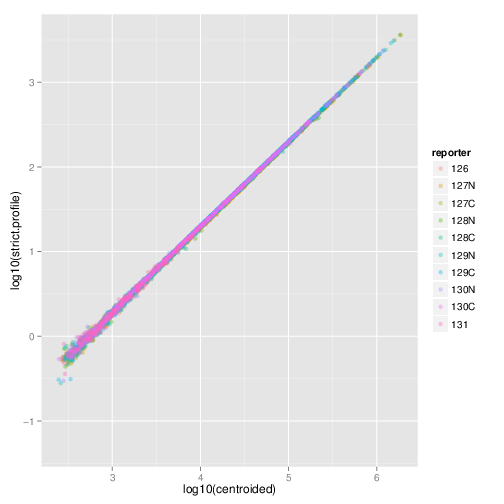

```{r style, echo = FALSE, results = 'asis'}
BiocStyle::markdown()
```


```{r environment, cache=FALSE, echo=FALSE}
suppressPackageStartupMessages(library("ggplot2"))
suppressPackageStartupMessages(library("MSnbase"))
suppressPackageStartupMessages(library("zoo"))
suppressPackageStartupMessages(require("Rdisop"))
suppressPackageStartupMessages(require("pRolocdata"))
suppressPackageStartupMessages(require("pRoloc"))
suppressPackageStartupMessages(require("msdata"))
library("grid")
suppressPackageStartupMessages(library("BiocParallel"))
```
```{r include_forword, echo=FALSE, results="asis"}
cat(readLines("./Foreword.md"), sep = "\n")
```

```{r include_bugs, echo=FALSE, results="asis"}
cat(readLines("./Bugs.md"), sep = "\n")
```

# Introduction {#sec:intro}

`r Biocpkg("MSnbase")` [@Gatto2012] aims are providing a reproducible
research framework to proteomics data analysis.  It should allow
researcher to easily mine mass spectrometry data, explore the data and
its statistical properties and visually display these.

`r Biocpkg("MSnbase")` also aims at being compatible with the
infrastructure implemented in Bioconductor, in particular
`r Biocpkg("Biobase")`. As such, classes developed specifically for
proteomics mass spectrometry data are based on the *eSet* and
*ExpressionSet* classes. The main goal is to assure seamless
compatibility with existing meta data structure, accessor methods and
normalisation techniques.

This vignette illustrates `r Biocpkg("MSnbase")` utility using a dummy
data sets provided with the package without describing the underlying
data structures. More details can be found in the package, classes,
method and function documentations. A description of the classes is
provided in the *MSnbase-development*
vignette^[in R, open it with `vignette("MSnbase-development")` or read it online [here](https://bioconductor.org/packages/devel/bioc/vignettes/MSnbase/inst/doc/MSnbase-development.html)].

## Speed and memory requirements

Raw mass spectrometry file are generally several hundreds of MB large
and most of this is used for binary raw spectrum data. As such, data
containers can easily grow very large and thus require large amounts
of RAM.  This requirement is being tackled by avoiding to load the raw
data into memory and using on-disk random access to the content of
`mzXML`/`mzML` data files on demand.  When focusing on reporter ion
quantitation, a direct solution for this is to trim the spectra using
the `trimMz` method to select the area of interest and thus
substantially reduce the size of the `Spectrum` objects. This is
illustrated in section \@ref(sec:trim).

**Parallel processing** The independent handling of spectra is ideally
suited for parallel processing.  The `quantify` method for example
performs reporter peaks quantitation in parallel.

Parallel support is provided by the `r Biocpkg("BiocParallel")` and
various backends including multicore (forking, default on Linux),
simple networf network of workstations (SNOW, default on Windows)
using sockets, forking or MPI among others. We refer readers to the
documentation in `r Biocpkg("BiocParallel")`. Automatic parallel
processing of spectra is only established for a certain number of
spectra (per file). This value (default is 1000) can be set with the
`setMSnbaseParallelThresh` function.

In sock-based parallel processing, the main worker process has to
start new R instances and connect to them via sock. Sometimes these
connections can not be established and the processes get stuck. To
test this, users can disable parallel processing by disabling parallel
processing with `register(SerialParam())`. To avoid these deadlocks,
it is possible to initiate the parallel processing setup explicitly at
the beginning of the script using, for example

```{r, eval=FALSE}
library("doParallel")
registerDoParallel(3) ## using 3 slave nodes
register(DoparParam(), default = TRUE)

## rest of script comes below
```

**On-disk access** Developmenets in version 2 of the package have
solved the memory issue by implementing and *on-disk* version the of
data class storing raw data (*MSnExp*, see section \@ref(sec:msnexp)),
where the spectra a accessed on-disk only when required. The
*benchmarking* vignette compares the on-disk and in-memory
implemenatations^[in R, open it with `vignette("benchmarking")` or
read it online
[here](https://bioconductor.org/packages/devel/bioc/vignettes/MSnbase/inst/doc/benchmarking.html)]. See
details below.

# Data structure and content {#sec:data}

## Importing experiments {#sec:io}

`r Biocpkg("MSnbase")` is able to import raw MS data stored in one of
the `XML`-based formats as well as peak lists in the `mfg`
format^[Mascot Generic Format, see <http://www.matrixscience.com/help/data_file_help.html#GEN>].

**Raw data** The `XML`-based formats, `mzXML` [@Pedrioli2004],
`mzData` [@Orchard2007] and `mzML` [@Martens2010] can be imported with
the `readMSData` function, as illustrated below (see `?readMSData` for
more details). To make use of the new *on-disk* implementation, set
`mode = "onDisk"` in `readMSData` rather than using the default `mode
= "inMemory"`.

```{r readdata, echo=TRUE, cache=FALSE, tidy=FALSE}
file <- dir(system.file(package = "MSnbase", dir = "extdata"),
            full.names = TRUE, pattern = "mzXML$")
rawdata <- readMSData(file, msLevel = 2, verbose = FALSE)
```

Only spectra of a given MS level can be loaded at a time by setting
the `msLevel` parameter accordingly in `readMSData` and *in-memory*
data. In this document, we will use the `itraqdata` data set, provided
with `r Biocpkg("MSnbase")`. It includes feature metadata, accessible
with the `fData` accessor.  The metadata includes identification data
for the `r length(itraqdata)` MS2 spectra.

Version 2.0 and later of `r Biocpkg("MSnbase")` provide a new
*on-disk* data storage model (see the *benchmarking* vignette for more
details). The new data backend is compatible with the orignal
*in-memory* model. To make use of the new infrastructure, read your
raw data by setting the `mode` argument to `"onDisk"` (the default is
still `"inMemory"` but is likely to change in the future). The new
*on-disk* implementation supports several MS levels in a single raw
data object. All existing operations work irrespective of the backend.

**Peak lists** can often be exported after spectrum processing from
vendor-specific software and are also used as input to search engines.
Peak lists in `mgf` format can be imported with the function
`readMgfData` (see `?readMgfData` for details) to create experiment
objects.  Experiments or individual spectra can be exported to an
`mgf` file with the `writeMgfData` methods (see `?writeMgfData` for
details and examples).


**Experiments with multiple runs** Although it is possible to load and
process multiple files serially and later merge the resulting
quantitation data as show in section \@ref(sec:combine), it is also
feasible to load several raw data files at once.  Here, we report the
analysis of an LC-MSMS experiment were 14 liquid chromatography (LC)
fractions were loaded in memory using `readMSData` on a 32-cores
servers with 128 Gb of RAM.  It took about 90 minutes to read the 14
uncentroided `mzXML` raw files (4.9 Gb on disk in total) and create a
3.3 Gb raw data object (an *MSnExp* instance, see next section).
Quantitation of 9 reporter ions (*iTRAQ9* object, see
\@ref(sec:reporterions)) for 88690 features was performed in parallel
on 16 processors and took 76 minutes.  The resulting quantitation data
was only 22.1 Mb and could easily be further processed. These number
are based on the older *in-memory* implementation. As shown in the
*benchmarking* vignette, using *on-disk* data greatly reduces memory
requirement and computation time.

See also section \@ref(sec:io2) to import quantitative data stored in
spreadsheets into R for further processing using `r Biocpkg("MSnbase")`.
The *MSnbase-io*vignette[in R, open it with `vignette("MSnbase-io")`
or read it online
[here](https://bioconductor.org/packages/devel/bioc/vignettes/MSnbase/inst/doc/MSnbase-io.html)]
gives a general overview of `r Biocpkg("MSnbase")`'s input/ouput
capabilites.

See section \@ref(sec:io3) for importing chromatographic data of SRM/MRM
experiments.

## Exporting experiments/MS data

`MSnbase` supports also to write `MSnExp` or `OnDiskMSnExp` objects to `mzML` or
`mzXML` files using the `writeMSData` function. This is specifically useful in
workflows in which the MS data was heavily manipulated. Presently, each
sample/file is exported into one file.

Below we write the data in `mzML` format to a temporary file. By setting the
optional parameter `copy = TRUE` general metadata (such as instrument info or
all data processing descriptions) are copied over from the originating file.

```{r writeMSData, cache = FALSE}
writeMSData(rawdata, file = paste0(tempfile(), ".mzML"), copy = TRUE)
```


## MS experiments {#sec:msnexp}

Raw data is contained in *MSnExp* objects, that stores all the
spectra of an experiment, as defined by one or multiple raw data
files.

```{r MSnExp, cache=FALSE, echo=TRUE}
library("MSnbase")
itraqdata
head(fData(itraqdata))
```

```{r experimentsize, echo=FALSE, cache=FALSE}
sz <- sum(sapply(assayData(itraqdata), object.size)) +
  object.size(itraqdata)
sz <- as.numeric(sz)
sz <- round(sz/(1024^2), 2)
```

As illustrated above, showing the experiment textually displays it's
content:

* Information about the raw data, i.e. the spectra.

* Specific information about the experiment
  processing^[This part will be automatically updated when the object is modified with it's *ad hoc* methods, as illustrated later.]
  and package version.  This slot can be accessed with the
  `processingData` method.

* Other meta data, including experimental phenotype, file name(s) used
  to import the data, protocol data, information about features
  (individual spectra here) and experiment data. Most of these are
  implemented as in the *eSet* class and are described in more details
  in their respective manual pages. See `?MSnExp` and references
  therein for additional background information.

  The experiment meta data associated with an *MSnExp* experiment is
  of class *MIAPE*. It stores general information about the experiment
  as well as MIAPE (Minimum Information About a Proteomics Experiment)
  information [@Taylor2007, @Taylor2008].  This meta-data can be
  accessed with the `experimentData` method.  When available, a
  summary of MIAPE-MS data can be printed with the `msInfo` method.
  See `?MIAPE` for more details.


## Spectra objects {#sec:spectra}

The raw data is composed of the `r length(itraqdata)` MS spectra.  The
spectra are named individually
(`r paste(paste(head(featureNames(itraqdata)),collapse=", "),", ...",sep="")`)
and stored in a `environment`. They can be accessed individually with
`itraqdata[["X1"]]` or `itraqdata[[1]]`, or as a list with
`spectra(itraqdata)`.  As we have loaded our experiment specifying
`msLevel=2`, the spectra will all be of level 2 (or higher, if
available).

```{r Spectrum, cache=FALSE, echo=TRUE}
sp <- itraqdata[["X1"]]
sp
```

Attributes of individual spectra or of all spectra of an experiment
can be accessed with their respective methods:
`precursorCharge` for the precursor charge,
`rtime` for the retention time, `mz` for the MZ
values, `intensity` for the intensities, ... see the
*Spectrum*, *Spectrum1* and *Spectrum2*
manuals for more details.

```{r accessors, cache=FALSE, echo=TRUE}
peaksCount(sp)
head(peaksCount(itraqdata))
rtime(sp)
head(rtime(itraqdata))
```

## Reporter ions {#sec:reporterions}

Reporter ions are defined with the *ReporterIons* class.
Specific peaks of interest are defined by a MZ value, a with around
the expected MZ and a name (and optionally a colour for plotting, see
section \@ref(sec:plotting)). *ReporterIons* instances are
required to quantify reporter peaks in *MSnExp*
experiments. Instances for the most commonly used isobaric tags like
iTRAQ 4-plex and 8-plex and TMT 6- and 10-plex tags are already
defined in `r Biocpkg("MSnbase")`. See `?ReporterIons` for
details about how to generate new *ReporterIons* objects.

```{r ReporterIons}
iTRAQ4
TMT10
```

## Chromatogram objects {#sec:chromatograms}

Chromatographic data, i.e. intensity values along the retention time dimension
for a given $m/z$ range/slice, can be extracted with the `chromatogram`
method. Below we read a file from the `msdata` package and extract the (MS level
1) chromatogram. Without providing an $m/z$ and a retention time range the
function returns the total ion chromatogram (TIC) for each file within the
`MSnExp` or `OnDiskMSnExp` object. See also section \@ref(sec:io3) for importing
chromatographic data from SRM/MRM experiments.

```{r Chromatogram}
f <- c(system.file("microtofq/MM14.mzML", package = "msdata"))
mtof <- readMSData(f, mode = "onDisk")
mtof_tic <- chromatogram(mtof)
mtof_tic
```

Chromatographic data, represented by the intensity-retention time duplets, is
stored in the `Chromatogram` object. The `chromatogram` method returns a
`Chromatograms` object (note the *s*) which holds multiple `Chromatogram`
objects and arranges them in a two-dimensional grid with columns representing
files/samples of the `MSnExp` or `OnDiskMSnExp` object and rows $m/z$-retention
time ranges. In the example above the `Chromatograms` object contains only a
single `Chromatogram` object. Below we access this chromatogram object. Similar
to the `Spectrum` objects, `Chromatogram` objects provide the accessor functions
`intensity` and `rtime` to access the data, as well as the `mz` function, that
returns the $m/z$ range of the chromatogram.

```{r Chromatogram-continue}
mtof_tic[1, 1]

head(intensity(mtof_tic[1, 1]))
head(rtime(mtof_tic[1, 1]))
mz(mtof_tic[1, 1])
```

To extract the base peak chromatogram (the largest peak
along the $m/z$ dimension for each retention time/spectrum) we set the
`aggregationFun` argument to `"max"`.

```{r Chromatogram-bpc}
mtof_bpc <- chromatogram(mtof, aggregationFun = "max")
```

See the `Chromatogram` help page and the vignettes from the `r Biocpkg("xcms")`
package for more details and use cases, also on how to extract
chromatograms for specific ions.


# Plotting raw data {#sec:plotting}

## MS data space {#sec:msmaps}

The *MSmap* class can be used to isolate specific slices of
interest from a complete MS acquisition by specifying $m/z$ and
retention time ranges. One needs a raw data file in a format supported
by `r Biocpkg("mzR")`'s `openMSfile` (`mzML`,
`mzXML`, ...). Below we first download a raw data file from the
PRIDE repository and create\footnote{This code chunk is not evaluated
  to avoid repeated downloaded of the raw data file. The `M`
  map is provided with the package and loaded to evaluate subsequent
  code chunks.} an *MSmap* containing all the MS1 spectra
between acquired between 30 and 35 minutes and peaks between 521 and
523 $m/z$. See `?MSmap` for details.

```{r msmap, eval=FALSE}
## downloads the data
library("rpx")
px1 <- PXDataset("PXD000001")
mzf <- pxget(px1, 7)

## reads the data
ms <- openMSfile(mzf)
hd <- header(ms)

## a set of spectra of interest: MS1 spectra eluted
## between 30 and 35 minutes retention time
ms1 <- which(hd$msLevel == 1)
rtsel <- hd$retentionTime[ms1] / 60 > 30 &
    hd$retentionTime[ms1] / 60 < 35

## the map
M <- MSmap(ms, ms1[rtsel], 521, 523, .005, hd, zeroIsNA = TRUE)
```

```{r msmaplaod, echo=FALSE}
mrda <- dir(system.file(package = "MSnbase", dir = "extdata"),
            full.names = TRUE, pattern = "M.rda$")
mrda2 <- dir(system.file(package = "MSnbase", dir = "extdata"),
            full.names = TRUE, pattern = "M2.rda$")
load(mrda)
load(mrda2)
```

```{r msmaphow}
M
```

The `M` map object can be rendered as a heatmap with `plot`, as shown
on figure \@ref(fig:mapheat).

```{r mapheat, fig.cap = "Heat map of a chunk of the MS data."}
plot(M, aspect = 1, allTicks = FALSE)
```


One can also render the data in 3 dimension with the `plot3D`
function, as show on figure \@ref(fig:map3d).

```{r map3d, fig.cap = "3 dimensional represention of MS map data."}
plot3D(M)
```


To produce figure \@ref(fig:map3d2), we create a second *MSmap*
object containing the first two MS1 spectra of the first map
(object `M` above) and all intermediate MS2 spectra and
display $m/z$ values between 100 and 1000.

```{r msmap2, eval=FALSE}
i <- ms1[which(rtsel)][1]
j <- ms1[which(rtsel)][2]
M2 <- MSmap(ms, i:j, 100, 1000, 1, hd)
```

```{r m2}
M2
```

```{r map3d2, fig.cap = "3 dimensional represention of MS map data. MS1 and MS2 spectra are coloured in blue and magenta respectively."}
plot3D(M2)
```


## MS Spectra {#sec:specplots}

Spectra can be plotted individually or as part of (subset) experiments
with the `plot` method. Full spectra can be plotted (using
`full=TRUE`), specific reporter ions of interest (by specifying
with reporters with `reporters=iTRAQ4` for instance) or both
(see figure \@ref(fig:spectrumPlot)).

```{r spectrumPlot, fig.keep='high', fig.cap = "Raw MS2 spectrum with details about reporter ions."}
plot(sp, reporters = iTRAQ4, full = TRUE)
```


```{r bsaSelect, eval=TRUE, echo=FALSE}
## bsasel <- fData(itraqdata)$ProteinAccession == "BSA"
bsasel <- 1:3
```

It is also possible to plot all spectra of an experiment (figure
\@ref(fig:msnexpPlot)).  Lets start by subsetting the `itraqdata`
experiment using the protein accession numbers included in the feature
metadata, and keep the `r sum(bsasel)` from the *BSA* protein.

```{r subset, echo=TRUE}
sel <- fData(itraqdata)$ProteinAccession == "BSA"
bsa <- itraqdata[sel]
bsa
as.character(fData(bsa)$ProteinAccession)
```

These can then be visualised together by plotting the *MSnExp* object,
as illustrated on figure \@ref(fig:msnexpPlot).

```{r msnexpPlot, fig.keep='last', fig.cap = "Experiment-wide raw MS2 spectra. The y-axes of the individual spectra are automatically rescaled to the same range. See section \\@ref(sec:norm) to rescale peaks identically."}
plot(bsa, reporters = iTRAQ4, full = FALSE) + theme_gray(8)
```

**Customising your plots** The `r Biocpkg("MSnbase")` `plot` methods
have a logical `plot` parameter (default is `TRUE`), that specifies if
the plot should be printed to the current device. A plot object is
also (invisibly) returned, so that it can be saved as a variable for
later use or for customisation.

`r Biocpkg("MSnbase")` uses the \CRANpkg{ggplot2} package to generate
plots, which can subsequently easily be customised.  More details
about \CRANpkg{ggplot2} can be found in [@ggplot2] (especially chapter
8) and on <http://had.co.nz/ggplot2/>. Finally, if a plot object has
been saved in a variable `p`, it is possible to obtain a summary of
the object with `summary(p)`.  To view the data frame used to generate
the plot, use `p$data`.

## MS Chromatogram {#sec:chromplots}

Chromatographic data can be plotted using the `plot` method which, in contrast
to the `plot` method for `Spectrum` classes, uses R base graphics. The `plot`
method is implemented for `Chromatogram` and `Chromatograms` classes. The latter
plots all chromatograms for the same $m/z$-rt range of all files in an
experiment (i.e. for one row in the `Chromatograms` object) into one plot.

```{r chromPlot, fig.keep='high', fig.cap = "Base peak chromatogram."}
plot(mtof_bpc)
```


# Tandem MS identification data {#sec:id}

Typically, identification data is produced by a search engine and
serialised to disk in the `mzIdentML` (or `mzid`) file format. This
format can be parsed by `openIDfile` from the `r Biocpkg("mzR")`
package or `mzID` from the `r Biocpkg("mzID")` package. The `MSnbase`
package relies on the former (which is faster) and offers a simplified
interface by converting the dedicated identification data objects into
`data.frames`.

```{r iddf0}
library("msdata")
f <- "TMT_Erwinia_1uLSike_Top10HCD_isol2_45stepped_60min_01-20141210.mzid"
idf <- msdata::ident(full.names = TRUE, pattern = f)
iddf <- readMzIdData(idf)
str(iddf)
```

The spectra along the rows are duplicated when the PSM can be assigned
to multiple proteins, such as

```{r dups1, echo=FALSE}
iddf[grep("scan=5291", iddf[, "spectrumID"]),
     c("spectrumID", "sequence", "DatabaseAccess")]
```

of when there are multiple modifications in a PSM, such as

```{r dups2, echo=FALSE}
iddf[grep("scan=4936", iddf[, "spectrumID"]),
     c("spectrumID", "sequence", "modName", "modLocation")]
```

At this stage, it is useful to perform some exploratory data analysis
and visualisation on the identification data. For example

```{r ideda}
table(iddf$isDecoy)
table(iddf$chargeState)
```

```{r idvis}
library("ggplot2")
ggplot(data = iddf, aes(x = MS.GF.RawScore, colour = isDecoy)) +
    geom_density() +
    facet_wrap(~chargeState)
```

The `filterIdentificationDataFrame` function can be used to remove
- PSMs that match decoy entries
- PSMs of rank > 1
- PSMs that match non-proteotypic proteins

```{r}
iddf <- filterIdentificationDataFrame(iddf)
```

This `data.frame` can be now be further reduced so that individual
rows represent unique spectra, which can be done with the `reduce`
method.

```{r rediddf}
iddf2 <- reduce(iddf, key = "spectrumID")
```

This reduces the number of rows from `r nrow(iddf)` to `r nrow(iddf2)`.

The first duplicated spectrum mentioned above is now unique as is
matched a decoy protein that was filtered out with
`filterIdentificationDataFrame`.

```{r dups3, echo=FALSE}
iddf2[grep("scan=5291", iddf2[, "spectrumID"]),
      c("spectrumID", "sequence", "DatabaseAccess")]
```

The matches to multiple modification in the same peptide are now
combined into a single row and documented as semicolon-separated
values.

```{r dups4, echo=FALSE}
iddf2[grep("scan=4936", iddf2[, "spectrumID"]),
     c("spectrumID", "sequence", "modName", "modLocation")]
```

This is the form that is used when combined to raw data, as described
in the next section.

## Adding identification data

`r Biocpkg("MSnbase")` is able to integrate identification data from
`mzIdentML` [@Jones2012] files.

We first load two example files shipped with the
`r Biocpkg("MSnbase")` containing raw data (as above) and the
corresponding identification results respectively. The raw data is
read with the `readMSData`, as demonstrated above. As can be seen, the
default feature data only contain spectra numbers. More data about the
spectra is of course available in an *MSnExp* object, as illustrated
in the previous sections. See also `?pSet` and `?MSnExp` for more
details.

```{r msnexpIdentification, echo=TRUE, cache=FALSE, tidy=FALSE}
## find path to a mzXML file
quantFile <- dir(system.file(package = "MSnbase", dir = "extdata"),
                 full.name = TRUE, pattern = "mzXML$")
## find path to a mzIdentML file
identFile <- dir(system.file(package = "MSnbase", dir = "extdata"),
                 full.name = TRUE, pattern = "dummyiTRAQ.mzid")
## create basic MSnExp
msexp <- readMSData(quantFile, verbose = FALSE)
head(fData(msexp), n = 2)
```


The `addIdentificationData` method takes an *MSnExp* instance (or an
*MSnSet* instance storing quantitation data, see section
\@ref(sec:quant)) as first argument and one or multiple `mzIdentML`
file names (as a character vector) as second one^[The identification data can also be passed as dedicated identification objects such as `mzRident` from the `r Biocpkg("mzR")` package or `mzID` from thr `r Biocpkg("mzID")` package, or as a `data.frame` - see `?addIdentifionData` for details.] and updates the
*MSnExp* feature data using the identification data read from the
`mzIdentML` file(s).

```{r msnexpIdentification2, echo=TRUE, cache=FALSE, tidy=FALSE}
msexp <- addIdentificationData(msexp, id = identFile)
head(fData(msexp), n = 2)
```

Finally we can use `idSummary` to summarise the percentage
of identified features per quantitation/identification pairs.

```{r msnexpIdentification3, echo=TRUE, cache=FALSE, tidy=FALSE}
idSummary(msexp)
```

When identification data is present, and hence peptide sequences, one
can annotation fragment peaks on the MS2 figure by passing the peptide
sequence to the `plot` method.

```{r fragplot0}
itraqdata2 <- pickPeaks(itraqdata, verbose=FALSE)
i <- 14
s <- as.character(fData(itraqdata2)[i, "PeptideSequence"])
```

```{r fragplot, fig.cap = "Annotated MS2 spectrum."}
plot(itraqdata2[[i]], s, main = s)
```

The fragment ions are calculated with the `calculateFragments`,
described in section \@ref(sec:calcfrag).

## Filtering identification data

One can remove the features that have not been identified using
`removeNoId`. This function uses by default the
`pepseq` feature variable to search the presence of missing data
(`NA` values) and then filter these non-identified spectra.

```{r msnexpIdentification4, echo=TRUE, cache=FALSE, tidy=FALSE}
fData(msexp)$sequence
msexp <- removeNoId(msexp)
fData(msexp)$sequence
idSummary(msexp)
```

Similarly, the `removeMultipleAssignment` method can be used
to filter out non-unique features, i.e. that have been assigned to
protein groups with more than one member. This function uses by
default the `nprot` feature variable.

Note that `removeNoId` and `removeMultipleAssignment` methods can also
be called on *MSnExp* instances.


## Calculate Fragments {#sec:calcfrag}

`r Biocpkg("MSnbase")` is able to calculate theoretical peptide fragments via
`calculateFragments`.

```{r calculateFragments, echo=TRUE, cache=FALSE, tidy=FALSE}
calculateFragments("ACEK",
                   type = c("a", "b", "c", "x", "y", "z"))
```

It is also possible to match these fragments against an *Spectrum2*
object.

```{r msnexpcalculateFragments, echo=TRUE, cache=FALSE, tidy=FALSE}
pepseq <- fData(msexp)$sequence[1]
calculateFragments(pepseq, msexp[[1]], type=c("b", "y"))
```

# Quality control {#sec:qc}

The current section is not executed dynamically for package size and
processing time constrains.  The figures and tables have been
generated with the respective methods and included statically in the
vignette for illustration purposes.

`r Biocpkg("MSnbase")` allows easy and flexible access to the data, which
allows to visualise data features to assess it's quality. Some methods
are readily available, although many QC approaches will be experiment
specific and users are encourage to explore their data.


The `plot2d` method takes one *MSnExp* instance as first argument to
produce retention time *vs.* precursor MZ scatter plots. Points
represent individual MS2 spectra and can be coloured based on
precursor charge (with second argument `z="charge"`), total ion count
(`z="ionCount"`), number of peaks in the MS2 spectra
`z="peaks.count"`) or, when multiple data files were loaded, file
`z="file"`), as illustrated on the [next figure](#fig:plot2d).  The
lower right panel is produced for only a subset of proteins.  See the
method documentation for more details.


{#fig:plot2d}

The `plotDensity` method illustrates the distribution of several
parameters of interest (see [figure below](#fig:plotDensity)).
Similarly to `plot2d`, the first argument is an *MSnExp* instance.
The second is one of `precursor.mz`, `peaks.count` or `ionCount`,
whose density will be plotted.  An optional third argument specifies
whether the x axes should be logged.

{#fig:plotDensity}


The `plotMzDelta`
method^[The code to generate the histograms has been contributed by Guangchuang Yu.]
implements the $m/z$ delta plot from [@Foster11] The $m/z$ delta plot
illustrates the suitability of MS2 spectra for identification by
plotting the $m/z$ differences of the most intense peaks. The
resulting histogram should optimally shown outstanding bars at amino
acid residu masses. More details and parameters are described in the
method documentation (`?plotMzDelta`).  The
[next figure](#fig:plotMzDelta) has been generated using the PRIDE
experiment 12011, as in [@Foster11].


![Illustration of the `plotMzDelta` output for the PRIDE experiment 12011, as in figure 4A from [@Foster11].](./Figures/plotMzDelta-pride12011.png){#fig:plotMzDelta}

In section \@ref(sec:incompdissoc), we illustrate how to assess
incomplete reporter ion dissociation.


# Raw data processing {#sec:rawprocessing}

## Cleaning spectra {#sec:clean}

There are several methods implemented to perform basic raw data
processing and manipulation. Low intensity peaks can be set to 0 with
the `removePeaks` method from spectra or whole
experiments. The intensity threshold below which peaks are removed is
defined by the `t` parameter. `t` can be specified
directly as a numeric. The default value is the character
`"min"`, that will remove all peaks equal to the lowest non
null intensity in any spectrum.  We observe the effect of the
`removePeaks` method by comparing total ion count (i.e. the
total intensity in a spectrum) with the `ionCount` method
before (object `itraqdata`) and after (object
`experiment`) for spectrum `X55`. The respective
spectra are shown on figure \@ref(fig:spectrum-clean-plot).


```{r removePeaks, echo=TRUE, cache=FALSE}
experiment <- removePeaks(itraqdata, t = 400, verbose = FALSE)
ionCount(itraqdata[["X55"]])
ionCount(experiment[["X55"]])
```

```{r spectrum-clean-plot, echo=FALSE, fig.keep='high', fig.cap = "Same spectrum before (left) and after setting peaks <= 400 to 0."}
p1 <- plot(itraqdata[["X55"]], full = TRUE, plot = FALSE) + theme_gray(5)
p2 <- plot(experiment[["X55"]], full = TRUE, plot = FALSE) + theme_gray(5)
grid.newpage()
pushViewport(viewport(layout = grid.layout(1, 2)))
vplayout <- function(x, y)
  viewport(layout.pos.row = x, layout.pos.col = y)
print(p1,vp=vplayout(1,1))
print(p2,vp=vplayout(1,2))
```

Unlike the name might suggest, the `removePeaks` method does not
actually remove peaks from the spectrum; they are set to 0. This can
be checked using the `peaksCount` method, that returns the number of
peaks (including 0 intensity peaks) in a spectrum.  To effectively
remove 0 intensity peaks from spectra, and reduce the size of the data
set, one can use the `clean` method.  The effect of the `removePeaks`
and `clean` methods are illustrated on figure \@ref(fig:preprocPlot).

```{r clean, echo=TRUE, cache=FALSE}
peaksCount(itraqdata[["X55"]])
peaksCount(experiment[["X55"]])
experiment <- clean(experiment, verbose = FALSE)
peaksCount(experiment[["X55"]])
```


```{r preprosp, cache=FALSE, echo=FALSE}
int <- c(0,1,1,3,1,1,0,0,0,1,3,7,3,1,0)
mz <- c(113.9,114.0,114.05,114.1,114.15,114.2,114.25,
        114.3,114.35,114.4,114.42,114.48,114.5,114.55,114.6)
ppsp <- new("Spectrum2",intensity=int,mz=mz,centroided=FALSE)
p1 <- plot(ppsp, full = TRUE, plot = FALSE) + theme_gray(5) +
  geom_point(size=3,alpha=I(1/3)) +
  geom_hline(yintercept=3,linetype=2) +
  ggtitle("Original spectrum")
p2 <- plot(removePeaks(ppsp,t=3), full=TRUE, plot = FALSE) +
  theme_gray(5) +
  geom_point(size=3,alpha=I(1/3)) +
  geom_hline(yintercept=3,linetype=2) +
  ggtitle("Peaks < 3 removed")
p3 <- plot(clean(removePeaks(ppsp,t=3)), full = TRUE, plot = FALSE) +
  theme_gray(5) +
  geom_point(size=3,alpha=I(1/3)) +
  geom_hline(yintercept=3,linetype=2) +
  ggtitle("Peaks < 3 removed and cleaned")
```


```{r preprocPlot, echo=FALSE, fig.cap = "This figure illustrated the effect or the `removePeaks` and `clean` methods. The left-most spectrum displays two peaks, of max height 3 and 7 respectively. The middle spectrum shows the result of calling `removePeaks` with argument `t=3`, which sets all data points of the first peak, whose maximum height is smaller or equal to `t` to 0. The second peak is unaffected. Calling `clean` after `removePeaks` effectively deletes successive 0 intensities from the spectrum, as shown on the right plot."}
grid.newpage()
pushViewport(viewport(layout = grid.layout(3, 1)))
print(p1, vp=vplayout(1, 1))
print(p2, vp=vplayout(2, 1))
print(p3, vp=vplayout(3, 1))
```


## Focusing on specific MZ values {#sec:trim}

Another useful manipulation method is `trimMz`, that takes as
parameters and *MSnExp* (or a *Spectrum*) and a numeric `mzlim`. MZ
values smaller then `min(mzlim)` or greater then `max(mzmax)` are
discarded. This method is particularly useful when one wants to
concentrate on a specific MZ range, as for reporter ions
quantification, and generally results in substantial reduction of data
size. Compare the size of the full trimmed experiment to the original
`r sz` Mb.

```{r trimMz, echo=TRUE, cache=FALSE}
range(mz(itraqdata[["X55"]]))
experiment <- filterMz(experiment, mzlim = c(112,120))
range(mz(experiment[["X55"]]))
experiment
```

As can be seen above, all processing performed on the experiment is
recorded and displayed as integral part of the experiment object.

## Spectrum processing {#sec:specproc}

*MSnExp* and *Spectrum2* instances also support standard
MS data processing such as smoothing and peak picking, as described in
the `smooth` and `pickPeak` manual pages. The
methods that either single spectra of experiments, process the
spectrum/spectra, and return a updated, processed, object. The
implementations originate from the \CRANpkg{MALDIquant} package
[@Gibb2012].

# MS2 isobaric tagging quantitation {#sec:isoquant}

## Reporter ions quantitation {#sec:quant}

Quantitation is performed on fixed peaks in the spectra, that are
specified with an *ReporterIons* object. A specific peak is
defined by it's expected `mz` value and is searched for within
`mz` $\pm$ `width`.  If no data is found, `NA`
is returned.

```{r reporters, echo=TRUE, cache=FALSE}
mz(iTRAQ4)
width(iTRAQ4)
```

```{r simplesp, cache=FALSE, echo=FALSE, fig.keep='none'}
int <- c(0, 1, 1, 3, 1, 1, 0)
mz <- c(113.9, 114.0, 114.05, 114.1, 114.15, 114.2, 114.25)
ssp <- new("Spectrum2", intensity = int, mz = mz, centroided = FALSE)
p <- plot(ssp, full = TRUE, plot = FALSE)
p <- p + theme_gray(5)
```

The `quantify` method takes the following parameters: an *MSnExp*
experiment, a character describing the quantification `method`, the
`reporters` to be quantified and a `strict` logical defining whether
data points ranging outside of `mz` $\pm$ `width` should be considered
for quantitation.  Additionally, a progress bar can be displaying when
setting the `verbose` parameter to `TRUE`.  Three quantification
methods are implemented, as illustrated on figure
\@ref(fig:quantitationPlot). Quantitation using `sum` sums all the
data points in the peaks to produce, for this example,
`r quantify(ssp, iTRAQ4[1], method = "sum")[[1]]`, whereas method `max`
only uses the peak's maximum intensity,
`r quantify(ssp, iTRAQ4[1], method = "max")[[1]]`. `Trapezoidation`
calculates the area under the peak taking the full with into account
(using `strict = FALSE` gives
`r round(quantify(ssp, iTRAQ4[1], method = "trap", strict =
FALSE)[[1]], 3)`) or only the width as defined by the reporter (using
`strict = TRUE` gives
`r round(quantify(ssp, iTRAQ4[1], method = "trap", strict =
TRUE)[[1]],3)`). See `?quantify` for more details.

```{r quantitationPlot, echo=FALSE, fig.cap = "The different quantitation methods. See text for details."}
grid.newpage()
pushViewport(viewport(layout = grid.layout(2, 2)))
vplayout <- function(x, y)
  viewport(layout.pos.row = x, layout.pos.col = y)
print(p + ggtitle("Quantitation using 'sum'") +
      geom_point(size = 3, alpha = I(1/3), colour = "red"),
      vp = vplayout(1, 1))
print(p + ggtitle("Quantitation using 'max'") +
      geom_point(aes(x = 114.1, y = 3),
                 alpha = I(1/18),
                 colour = "red", size = 3),
      vp = vplayout(1, 2))
print(p +
      ggtitle("Trapezoidation and strict=FALSE") +
      geom_polygon(alpha = I(1/5), fill = "red"),
      vp = vplayout(2, 1))
print(p +
      ggtitle("Trapezoidation and strict=TRUE") +
      geom_polygon(aes(x = c(NA, 114.05, 114.05, 114.1, 114.15, 114.15, NA),
                       y = c(NA, 0, 1, 3, 1, 0, NA)), fill = "red", alpha = I(1/5)),
      vp = vplayout(2,2))
```


The `quantify` method returns *MSnSet* objects, that extend the
well-known *eSet* class defined in the `r Biocpkg("Biobase")`
package. *MSnSet* instances are very similar to *ExpressionSet*
objects, except for the experiment meta-data that captures MIAPE
specific information.  The assay data is a matrix of dimensions $n
\times m$, where $m$ is the number of features/spectra originally in
the *MSnExp* used as parameter in `quantify` and $m$ is the number of
reporter ions, that can be accessed with the `exprs` method.  The meta
data is directly inherited from the *MSnExp* instance.

```{r quantify, echo=TRUE, cache=FALSE, tidy=FALSE}
qnt <- quantify(experiment,
                method = "trap",
                reporters = iTRAQ4,
                strict = FALSE,
                verbose = FALSE)
qnt
head(exprs(qnt))
```

The [next figure](#fig:tmt10) illustrates the quantitation of the TMT
10-plex isobaric tags using the `quantify` method and the `TMT10`
reporter instance. The data on the $x$ axis has been quantified using
`method = "max"` and centroided data (as generated using
ProteoWizard's `msconvert` with vendor libraries' peak picking); on
the $y$ axis, the quantitation method was `trapezoidation` and
`strict = TRUE` (that's important for TMT 10-plex) and the profile data. We
observe a very good correlation.


{#fig:tmt10}

If no peak is detected for a reporter ion peak, the respective
quantitation value is set to `NA`. In our case, there
is `r sum(is.na(exprs(qnt)))` such case in row
`r which(is.na(exprs(qnt))) %% nrow(qnt)`.
We will remove the offending line using the `filterNA` method.
The `pNA` argument defines the percentage of accepted missing
values per feature. As we do not expect any missing peaks, we set it
to be 0 (which is also the detault value).

```{r filterNA, echo=TRUE}
table(is.na(qnt))
qnt <- filterNA(qnt, pNA = 0)
sum(is.na(qnt))
```

The filtering criteria for `filterNA` can also be defined as
a pattern of columns that can have missing values and columns that
must not exhibit any.  See `?filterNA` for details and
examples.

The infrastructure around the *MSnSet* class allows flexible
filtering using the `[` sub-setting operator. Below, we
mimic the behaviour of `filterNA(, pNA = 0)` by calculating
the row indices that should be removed, i.e. those that have at least
one `NA` value and explicitly remove these rows.  This method
allows one to devise and easily apply any filtering strategy.

```{r removeNa, echo=TRUE, eval=FALSE}
whichRow <- which(is.na((qnt))) %% nrow(qnt)
qnt <- qnt[-whichRow, ]
```

See also the `plotNA` method to obtain a graphical overview of
the completeness of a data set.

## Importing quantitation data {#sec:io2}

If quantitation data is already available as a spreadsheet, it can be
imported, along with additional optional feature and sample (pheno) meta data,
with the `readMSnSet` function. This function takes the
respective text-based spreadsheet (comma- or tab-separated) file names
as argument to create a valid *MSnSet* instance.

Note that the quantitation data of *MSnSet* objects can also
be exported to a text-based spreadsheet file using the
`write.exps` method.

`r Biocpkg("MSnbase")` also supports the `mzTab`
format\footnote{<https://github.com/HUPO-PSI/mzTab>}, a
light-weight, tab-delimited file format for proteomics
data. `mzTab` files can be read into R with
`readMzTabData` to create and *MSnSet* instance.

See the *MSnbase-io* vignette for a general overview of
`r Biocpkg("MSnbase")`'s input/ouput capabilites.

## Importing chromatographic data from SRM/MRM experiments {#sec:io3}

Data from SRM/MRM experiments can be imported from `mzML` files using the
`readSRMData` function. The `mzML` files are expected to contain chromatographic
data for the same precursor and product m/z values. The function returns a
`Chromatograms` object that arranges the data in a two-dimensional array, each
column representing the data of one file (sample) and each row the
chromatographic data for the same polarity, precursor and product m/z. In the
example code below we load a single SRM file using `readSRMData`.

```{r readSRMData, echo = TRUE, warning = FALSE}
fl <- proteomics(full.names = TRUE, pattern = "MRM")
srm <- readSRMData(fl)

srm
```

The precursor and product m/z values can be extracted with the `precursorMz` and
`productMz` functions. These functions always return a matrix, each row
providing the lower and upper m/z value of the isolation window (in most cases
minimal and maximal m/z will be identical).

```{r srm-precursorMz}
head(precursorMz(srm))

head(productMz(srm))
```

## Peak adjustments {#sec:purcor}

**Single peak adjustment** In certain cases, peak intensities
need to be adjusted as a result of peak interferance. For example, the
$+1$ peak of the phenylalanine (F, Phe) immonium ion (with $m/z$ 120.03)
inteferes with the 121.1 TMT reporter ion.  Below, we calculate the
relative intensity of the +1 peaks compared to the main peak using the
`r Biocpkg("Rdisop")` package.

```{r pheplus1, echo=TRUE, cache=FALSE}
library(Rdisop)
## Phenylalanine immonium ion
Fim <- getMolecule("C8H10N")
getMass(Fim)
isotopes <- getIsotope(Fim)
F1 <- isotopes[2, 2]
F1
```

If desired, one can thus specifically quantify the F immonium ion in
the MS2 spectrum, estimate the intensity of the +1 ion
(`r round(F1,4)`% of the F peak) and substract this calculated
value from the 121.1 TMT reporter intensity.

The above principle can also be generalised for a set of overlapping
peaks, as described below.

**Reporter ions purity correction** Impurities in the reporter
reagents can also bias the results and can be corrected when
manufacturers provide correction coefficients.  These generally come
as percentages of each reporter ion that have masses differing by -2,
-1, +1 and +2 Da from the nominal reporter ion mass due to isotopic
variants.  The `purityCorrect` method applies such correction to
*MSnSet* instances. It also requires a square matrix as second
argument, `impurities`, that defines the relative percentage of
reporter in the quantified each peak.  See `?purityCorrect` for more
details.

```{r purityCorrect, echo=TRUE, cache=FALSE, tidy = FALSE}
impurities <- matrix(c(0.929, 0.059, 0.002, 0.000,
                       0.020, 0.923, 0.056, 0.001,
                       0.000, 0.030, 0.924, 0.045,
                       0.000, 0.001, 0.040, 0.923),
                     nrow = 4)
qnt.crct <- purityCorrect(qnt, impurities)
head(exprs(qnt))
head(exprs(qnt.crct))
```

The `makeImpuritiesMatrix` can be used to create impurity
matrices.  It opens a rudimentary spreadsheet that can be directly
edited.

# Processing quantitative data {#sec:qproc}

## Data imputation {#sec:imp}

A set of imputation methods are available in the `impute`
method: it takes an *MSnSet* instance as input, the name of the
imputation method to be applied (one of
`r paste(imputeMethods(), collapse=", ")`),
possible additional parameters and returns an updated for *MSnSet*
without any missing values. Below, we apply a deterministic minimum
value imputation on the `naset` example data:

```{r impute}
## an example MSnSet containing missing values
data(naset)
table(is.na(naset))
## number of NAs per protein
table(fData(naset)$nNA)
x <- impute(naset, "min")
processingData(x)
table(is.na(x))
```


As described in more details in [@Lazar:2016], there are two types
of mechanisms resulting in missing values in LC/MSMS experiments.

* Missing values resulting from absence of detection of a feature,
  despite ions being present at detectable concentrations.  For
  example in the case of ion suppression or as a result from the
  stochastic, data-dependent nature of the MS acquisition
  method. These missing value are expected to be randomly distributed
  in the data and are defined as *missing at random* (MAR) or *missing
  completely at random* (MCAR).

* Biologically relevant missing values, resulting from the *absence*
  of the low abundance of ions (below the limit of detection of the
  instrument). These missing values are not expected to be randomly
  distributed in the data and are defined as *missing not at random*
  (MNAR).


MAR and MCAR values can be reasonably well tackled by many imputation
methods. MNAR data, however, requires some knowledge about the
underlying mechanism that generates the missing data, to be able to
attempt data imputation. MNAR features should ideally be imputed with
a *left-censor* (for example using a deterministic or
probabilistic minimum value) method. Conversely, it is recommended to
use *hot deck* methods (for example nearest neighbour, maximum
likelihood, etc) when data are missing at random.

```{r miximp, echo = FALSE, fig.cap = "Mixed imputation method. Black cells represent presence of quantitation values and light grey corresponds to missing data. The two groups of interest are depicted in green and blue along the heatmap columns. Two classes of proteins are annotated on the left: yellow are proteins with randomly occurring missing values (if any) while proteins in brown are candidates for non-random missing value imputation."}
x <- impute(naset, "zero")
exprs(x)[exprs(x) != 0] <- 1
suppressPackageStartupMessages(library("gplots"))
heatmap.2(exprs(x), col = c("lightgray", "black"),
          scale = "none", dendrogram = "none",
          trace = "none", keysize = 0.5, key = FALSE,
          RowSideColors = ifelse(fData(x)$randna, "orange", "brown"),
          ColSideColors = rep(c("steelblue", "darkolivegreen"), each = 8))
```

It is anticipated that the identification of both classes of missing
values will depend on various factors, such as feature intensities and
experimental design. Below, we use perform mixed imputation, applying
nearest neighbour imputation on the `r sum(fData(naset)$randna)`
features that are assumed to contain randomly distributed missing
values (if any) (yellow on figure \@ref(fig:miximp)) and a
deterministic minimum value imputation on the
`r sum(!fData(naset)$randna)` proteins that display a non-random pattern
of missing values (brown on figure \@ref(fig:miximp)).

```{r miximp2}
x <- impute(naset, method = "mixed",
            randna = fData(naset)$randna,
            mar = "knn", mnar = "min")
x
```


Please read `?impute` for a description of the different
methods.

## Normalisation {#sec:norm}

A *MSnSet* object is meant to be compatible with further
downstream packages for data normalisation and statistical
analysis. There is also a `normalise` (also available as
`normalize`) method for expression sets. The method takes
and instance of class *MSnSet* as first argument, and a
character to describe the `method` to be used:

* `quantiles`: Applies quantile normalisation [@Bolstad03] as
  implemented in the `normalize.quantiles` function of the
  `r Biocpkg("preprocessCore")` package.

* `quantiles.robust`: Applies robust quantile normalisation
  [@Bolstad03] as implemented in the `normalize.quantiles.robust`
  function of the `r Biocpkg("preprocessCore")` package.

* `vsn`: Applies variance stabilisation normalization [@Huber2002] as
  implemented in the `vsn2` function of the `r Biocpkg("vsn")`
  package.

* `max`: Each feature's reporter intensity is divided by the maximum of
  the reporter ions intensities.

* `sum`: Each feature's reporter intensity is divided by the sum of the
  reporter ions intensities.

See `?normalise` for more methods. A `scale` method for *MSnSet*
instances, that relies on the `base::scale` function.

```{r normalise, echo=TRUE, cache=FALSE}
qnt.max <- normalise(qnt, "max")
qnt.sum <- normalise(qnt, "sum")
qnt.quant <- normalise(qnt, "quantiles")
qnt.qrob <- normalise(qnt, "quantiles.robust")
qnt.vsn <- normalise(qnt, "vsn")
```

The effect of these are illustrated on figure \@ref(fig:normPlot) and
figure \@ref(fig:cvPlot) reproduces figure 3 of [@Karp2010] that
described the application of vsn on iTRAQ reporter data.


```{r normPlot, echo=FALSE, fig.cap = "Comparison of the normalisation *MSnSet* methods. Note that vsn also glog-transforms the intensities."}
.plot <- function(x, ttl = NULL) {
  boxplot(exprs(x),
          main = ifelse(is.null(ttl), processingData(x)@processing[2], ttl),
          cex.main = .8,
          cex.lab = .5,
          cex.axis = .5,
          cex = .8)
  grid()
}
oldmar <- par()$mar
par(mfrow=c(3,2),mar=c(2.9,2.9,2.9,1))
.plot(qnt, ttl = "Non-normalised data")
.plot(qnt.max, ttl = "Maximum")
.plot(qnt.sum, ttl = "Sum")
.plot(qnt.quant, ttl = "Quantile")
.plot(qnt.qrob, ttl = "Robust quantile")
.plot(qnt.vsn, ttl = "vsn")
```


```{r cvdata, echo=FALSE, cache=FALSE}
sd1 <- apply(log2(exprs(qnt))+10,1,sd)
mn1 <- apply(log2(exprs(qnt))+10,1,mean)
cv1 <- sd1/mn1
sd2 <- apply(exprs(qnt.vsn)+10,1,sd)
mn2 <- apply(exprs(qnt.vsn)+10,1,mean)
cv2 <- sd2/mn2
dfr <- rbind(data.frame(rank=order(mn1),cv=cv1,norm="raw"),
             data.frame(rank=order(mn2),cv=cv2,norm="vsn"))
library("zoo")
## rmed1 <- rollapply(cv1,7,function(x) median(x,na.rm=TRUE))
## rmed2 <- rollapply(cv2,7,function(x) median(x,na.rm=TRUE))
##
## Calling directly rollapply.zoo to make it zoo_1.6-4 compatible.
## The above requires zoo >= 1.7-0, which is as of 15 March 2011
## not yet available on CRAN (only on r-forge).
rmed1 <- zoo:::rollapply.zoo(cv1,7,function(x) median(x,na.rm=TRUE))
rmed2 <- zoo:::rollapply.zoo(cv2,7,function(x) median(x,na.rm=TRUE))
dfr2 <-
  rbind(data.frame(x=seq(1,70,by=(70/length(rmed1))),
                   y=rmed1,norm="raw"),
        data.frame(x=seq(1,70,by=(70/length(rmed1))),
                   y=rmed2,norm="vsn"))

p <- qplot(rank,cv,data=dfr,col=norm) +
  geom_line(data=dfr2,aes(x=x,y=y,colour=norm)) +
  theme_gray(7)
```

```{r cvPlot, echo=FALSE, fig.cap = "CV versus signal intensity comparison for log2 and vsn transformed data. Lines indicate running CV medians."}
print(p)
```

Note that it is also possible to normalise individual spectra or whole
*MSnExp* experiments with the `normalise` method using the `max`
method.  This will rescale all peaks between 0 and 1.  To visualise
the relative reporter peaks, one should this first trim the spectra
using method `trimMz` as illustrated in section
\@ref(sec:rawprocessing), then normalise the *MSnExp* with `normalise`
using `method="max"` as illustrated above and plot the data using
`plot` (figure \@ref(fig:msnexpNormPlot)).

```{r prepareMsnsetNormPlot, cache=FALSE, echo=FALSE, keep.fig='none'}
p <- plot(normalise(experiment[bsasel], "max"),
          reporters = iTRAQ4, full = FALSE, plot = FALSE)
p <- p + theme_gray(7)
```


```{r msnexpNormPlot, echo=FALSE, fig.cap = "Experiment-wide normalised MS2 spectra. The y-axes of the individual spectra is now rescaled between 0 and 1 (highest peak), as opposed to figure \\@ref(fig:msnexpPlot)."}
print(p)
```


Additional dedicated normalisation method are available for MS2
label-free quantitation, as described in section \@ref(sec:lf) and in
the `quantify` documentation.

# Feature aggregation {#sec:feataggregation}

The above quantitation and normalisation has been performed on
quantitative data obtained from individual spectra. However, the
biological unit of interest is not the spectrum but the peptide or the
protein. As such, it is important to be able to summarise features
that belong to a same group, i.e. spectra from one peptide, peptides
that originate from one protein, or directly combine all spectra that
have been uniquely associated to one protein.

`r Biocpkg("MSnbase")` provides one function, `combineFeatures`,
that allows to aggregate features stored in an *MSnSet* using
build-in or user defined summary function and return a new
*MSnSet* instance.  The three main arguments are described
below.  Additional details can be found in the method documentation.

```{r makeGroups1,echo=FALSE,cache=FALSE}
gb <- fData(qnt)$ProteinAccession
```

`combineFeatures`'s first argument, `object`, is an instance of class
*MSnSet*, as has been created in the section \@ref(sec:quant) for
instance.  The second argument, `groupBy`, is a `factor` than has as
many elements as there are features in the *MSnSet* `object`
argument. The features corresponding to the `groupBy` levels will be
aggregated so that the resulting *MSnSet* output will have
`length(levels(groupBy))` features. Here, we will combine individual
MS2 spectra based on the protein they originate from.  As shown below,
this will result in `r length(table(gb))` new aggregated features.

```{r makeGroups2,echo=TRUE,cache=FALSE}
gb <- fData(qnt)$ProteinAccession
table(gb)
length(unique(gb))
```

The third argument, `method`, defined how to combine the
features. Predefined functions are readily available and can be
specified as strings (`method="mean"`, `method="median"`, `method="sum"`,
`method="weighted.mean"` or `method="medianpolish"` to compute respectively
the mean, media, sum, weighted mean or median polish of the features
to be aggregated).  Alternatively, is is possible to supply user
defined functions with `method=function(x) { ... }`. We will use the
`median` here.

```{r combineFeatures, echo=TRUE, cache=FALSE}
qnt2 <- combineFeatures(qnt, groupBy = gb, method = "median")
qnt2
```

Of interest is also the `iPQF` spectra-to-protein summarisation
method, which integrates peptide spectra characteristics and
quantitative values for protein quantitation estimation. See `?iPQF`
and references therein for details.

# Label-free MS2 quantitation {#sec:lf}

## Peptide counting

Note that if samples are not multiplexed, label-free MS2
quantitation by spectral counting is possible using
`r Biocpkg("MSnbase")`. Once individual spectra have been assigned to
peptides and proteins (see section \@ref(sec:id)), it becomes
straightforward to estimate protein quantities using the simple
peptide counting method, as illustrated in section
\@ref(sec:feataggregation).

```{r count}
sc <- quantify(msexp, method = "count")
## lets modify out data for demonstration purposes
fData(sc)$DatabaseAccess[1] <- fData(sc)$DatabaseAccess[2]
fData(sc)$DatabaseAccess
sc <- combineFeatures(sc, groupBy = fData(sc)$DatabaseAccess,
                      method = "sum")
exprs(sc)
```

Such count data could then be further analyses using dedicated count
methods (originally developed for high-throughput sequencing) and
directly available for *MSnSet* instances in the
`r Biocpkg("msmsTests")` Bioconductor package.

## Spectral counting and intensity methods

The spectral abundance factor (SAF) and the normalised form (NSAF)
[@Paoletti2006] as well as the spectral index (SI) and other
normalised variations (SI$_{GI}$ and SI$_N$) [@Griffin2010] are
also available. Below, we illustrate how to apply the normalised
SI$_N$ to the experiment containing identification data produced in
section \@ref(sec:id).

The spectra that did not match any peptide have already been remove
with the `removeNoId` method. As can be seen in the
following code chunk, the first spectrum could not be matched to any
single protein. Non-identified spectra and those matching multiple
proteins are removed automatically prior to any label-free
quantitation. Once can also remove peptide that do not match uniquely
to proteins (as defined by the `nprot` feature variable column)
with the `removeMultipleAssignment` method.

```{r labelfree}
fData(msexp)[, c("DatabaseAccess", "nprot")]
```

Note that the label-free methods implicitely apply feature aggregation
(section \@ref(sec:feataggregation)) and normalise (section
\@ref(sec:norm)) the quantitation values based on the total sample
intensity and or the protein lengths (see [@Paoletti2006] and
[@Griffin2010] for details).

Let's now proceed with the quantitation using the `quantify`, as in
section \@ref(sec:quant), this time however specifying the method of
interest, `SIn` (the `reporters` argument can of course be ignored
here). The required peptide-protein mapping and protein lengths are
extracted automatically from the feature meta-data using the default
`accession` and `length` feature variables.

```{r SIn}
siquant <- quantify(msexp, method = "SIn")
processingData(siquant)
exprs(siquant)
```

Other label-free methods can be applied by specifiying the appropriate
`method` argument. See `?quantify` for more details.

# Spectra comparison

## Plotting two spectra

`r Biocpkg("MSnbase")` provides functionality to compare spectra against
each other. The first notable function is `plot`. If two
*Spectrum2* objects are provided `plot` will draw
two plots: the upper and lower panel contain respectively the first
and second spectrum. Common peaks are drawn in a slightly darker
colour.

```{r compms2plot, fig.cap = "Comparing two MS2 spectra."}
centroided <- pickPeaks(itraqdata, verbose = FALSE)
(k <- which(fData(centroided)[, "PeptideSequence"] == "TAGIQIVADDLTVTNPK"))
mzk <- precursorMz(centroided)[k]
zk <- precursorCharge(centroided)[k]
mzk * zk
plot(centroided[[k[1]]], centroided[[k[2]]])
```

## Comparison metrics

Currently `r Biocpkg("MSnbase")` supports three different metrics to
compare spectra against each other: `common` to calculate the
number of common peaks, `cor` to calculate the Pearson
correlation and `dotproduct` to calculate the dot product. See
`?compareSpectra` to apply other arbitrary metrics.

```{r compareSpectra, tidy=FALSE}
compareSpectra(centroided[[2]], centroided[[3]],
               fun = "common")
compareSpectra(centroided[[2]], centroided[[3]],
               fun = "cor")
compareSpectra(centroided[[2]], centroided[[3]],
               fun = "dotproduct")
```

`compareSpectra` supports *MSnExp* objects as well.

```{r msnexpcompareSpectra}
compmat <- compareSpectra(centroided, fun="cor")
compmat[1:10, 1:5]
```

Below, we illustrate how to compare a set of spectra using a
hierarchical clustering.

```{r dendo}
plot(hclust(as.dist(compmat)))
```


# Quantitative assessment of incomplete dissociation {#sec:incompdissoc}

Quantitation using isobaric reporter tags assumes complete
dissociation between the reporter group (red on the
[figure below](#fig:itraqchem)), balance group (blue) and peptide (the
peptide reactive group is drawn in green).  However, incomplete
dissociation does occur and results in an isobaric tag (i.e reporter
and balance groups) specific peaks.

{#fig:itraqchem}


`r Biocpkg("MSnbase")` provides, among others, a *ReporterIons* object
for iTRAQ 4-plex that includes the 145 peaks, called *iTRAQ5*. This
can then be used to quantify the experiment as show in section
\@ref(sec:quant) to estimate incomplete dissociation for each
spectrum.

```{r incompdiss, echo=TRUE, cache=FALSE, tidy=FALSE}
iTRAQ5
incompdiss <- quantify(itraqdata,
                       method = "trap",
                       reporters = iTRAQ5,
                       strict = FALSE,
                       verbose = FALSE)
head(exprs(incompdiss))
```

Figure \@ref(fig:incompdissPlot) compares these intensities for the whole
experiment.

```{r incompdissPlot, echo=FALSE, warning=FALSE, fig.cap ="Boxplot and scatterplot comparing intensities of the 4 reporter ions (or their sum, on the right) and the incomplete dissociation specific peak."}
dfr <- cbind(expand.grid("feature" = featureNames(incompdiss),
                         "reporters" = sub("iTRAQ5\\.", "",
                                           sampleNames(incompdiss)),
                         stringsAsFactors=FALSE),
             "intensity" = as.vector(exprs(incompdiss)))
repsum <- rowSums(exprs(incompdiss)[, 1:4])
dfr2 <- data.frame(iTRAQ1to4 = repsum, iTRAQ5 = exprs(incompdiss)[,5])
p1 <- ggplot(data = dfr, aes(x = reporters,y = log10(intensity))) +
  geom_boxplot() +
  theme_gray(6)
p2 <- ggplot(data = dfr2, aes(x = log10(iTRAQ1to4), y = log10(iTRAQ5))) +
  geom_point(alpha = I(1/2)) +
  geom_abline(intercept = 0, slope = 1, linetype = "dotted") +
  stat_smooth(method = lm, se = FALSE) +
  xlab(label = expression(log[10]~sum~114~to~117)) +
  ylab(label = expression(log[10]~145)) +
  theme_gray(6)
grid.newpage()
pushViewport(viewport(layout = grid.layout(1, 2)))
print(p1, vp = vplayout(1, 1))
print(p2, vp = vplayout(1, 2))
```


# Combining *MSnSet* instances {#sec:combine}


Combining mass spectrometry runs can be done in two different ways
depending on the nature of these runs. If the runs represent repeated
measures of identical samples, for instance multiple fractions, the
data has to be combine along the row of the quantitation matrix: all
the features (along the rows) represent measurements of the same set
of samples (along the columns). In this situation, described in
section \@ref(sec:comb1), two experiments of dimensions $n_1$ (rows) by
$m$ (columns and $n_2$ by $m$ will produce a new experiment of
dimensions $n_1 + n_2$ by $m$.

When however, different sets of samples have been analysed in
different mass spectrometry runs, the data has to be combined along
the columns of the quantitation matrix: some features will be shared
across experiments and should thus be aligned on a same row in the new
data set, whereas unique features to one experiment should be set as
missing in the other one.  In this situation, described in section
\@ref(sec:comb2), two experiments of dimensions $n_1$ by $m_1$ and
$n_2$ by $m_2$ will produce a new experiment of dimensions
$unique_{n_1} + unique_{n_2} + shared_{n_1, n_2}$ by $m_1 + m_2$.  The
two first terms of the first dimension will be complemented by
`NA` values.

Default *MSnSet* feature names (`X1`, `X2`, ...) and sample names
(`iTRAQ4.114`, `iTRAQ4.115`, `iTRAQ4.116`, ...) are not informative.
The features and samples of these anonymous quantitative data-sets
should be updated before being combined, to guide how to meaningfully
merge them.


## Combining identical samples {#sec:comb1}

To simulate this situation, let us use quantiation data from the
`itraqdata` object that is provided with the package as
experiment 1 and the data from the `rawdata` *MSnExp*
instance created at the very beginning of this document. Both
experiments share the *same* default iTRAQ 4-plex reporter names
as default sample names, and will thus automatically be combined along
rows.

```{r makeexp12, echo=TRUE, cache=FALSE, tidy = FALSE}
exp1 <- quantify(itraqdata, reporters = iTRAQ4,
                 verbose = FALSE)
sampleNames(exp1)
centroided(rawdata) <- FALSE
exp2 <- quantify(rawdata, reporters = iTRAQ4,
                 verbose = FALSE)
sampleNames(exp2)
```

It important to note that the features of these independent
experiments share the same default anonymous names: X1, X2, X3, ...,
that however represent quantitation of distinct physical analytes.  If
the experiments were to be combined as is, it would result in an error
because data points for the same *feature* name (say `X1`) and the
same *sample name* (say `iTRAQ4.114`) have different values.  We thus
first update the feature names to explicitate that they originate from
different experiment and represent quantitation from different spectra
using the convenience function `updateFeatureNames`.  Note that
updating the names of one experiment would suffice here.

```{r updateFnames, echo=TRUE, cache=FALSE}
head(featureNames(exp1))
exp1 <- updateFeatureNames(exp1)
head(featureNames(exp1))
head(featureNames(exp2))
exp2 <- updateFeatureNames(exp2)
head(featureNames(exp2))
```

The two experiments now share the same sample names and have different
feature names and will be combined along the row. Note that all
meta-data is correctly combined along the quantitation values.

```{r comb1, echo=TRUE, cache=FALSE}
exp12 <- combine(exp1, exp2)
dim(exp1)
dim(exp2)
dim(exp12)
```

## Combine different samples {#sec:comb2}

Lets now create two *MSnSet*s from the same raw data to simulate two
different independent experiments that share some features.  As done
previously (see section \@ref(sec:feataggregation)), we combine the
spectra based on the proteins they have been identified to belong to.
Features can thus naturally be named using protein accession numbers.
Alternatively, if peptide sequences would have been used as grouping
factor in `combineFeatures`, then these would be good feature name
candidates.

```{r make2exps2, echo=TRUE, cache=FALSE, tidy=FALSE}
set.seed(1)
i <- sample(length(itraqdata), 35)
j <- sample(length(itraqdata), 35)
exp1 <- quantify(itraqdata[i], reporters = iTRAQ4,
                 verbose = FALSE)
exp2 <- quantify(itraqdata[j], reporters = iTRAQ4,
                 verbose = FALSE)
exp1 <- droplevels(exp1)
exp2 <- droplevels(exp2)
table(featureNames(exp1) %in% featureNames(exp2))
exp1 <- combineFeatures(exp1,
                        groupBy = fData(exp1)$ProteinAccession)
exp2 <- combineFeatures(exp2,
                        groupBy = fData(exp2)$ProteinAccession)
head(featureNames(exp1))
head(featureNames(exp2))
```

The `droplevels` drops the unused `featureData`
levels.  This is required to avoid passing absent levels as
`groupBy` in `combineFeatures`.  Alternatively, one
could also use `factor(fData(exp1)\$ProteinAccession)` as
`groupBy` argument.

The feature names are updated automatically by
`combineFeatures`, using the `groupBy` argument.
Proper feature names, reflecting the nature of the features (spectra,
peptides or proteins) is critical when multiple experiments are to be
combined, as this is done using common features as defined by their
names (see below).


Sample names should also be updated to replace anonymous reporter
names with relevant identifiers; the individual reporter data is
stored in the `phenoData` and is not lost.  A convenience
function `updateSampleNames` is provided to append the
*MSnSet*'s variable name to the already defined names,
although in general, biologically relevant identifiers are preferred.

```{r renameSamples, echo=TRUE, cache=FALSE}
sampleNames(exp1)
exp1 <- updateSampleNames(exp1)
sampleNames(exp1)
sampleNames(exp1) <- c("Ctrl1", "Cond1", "Ctrl2", "Cond2")
sampleNames(exp2) <- c("Ctrl3", "Cond3", "Ctrl4", "Cond4")
```

At this stage, it is not yet possible to combine the two experiments,
because their feature data is not compatible yet; they share the same
feature variable labels, i.e. the feature data column names
(`r paste(head(fvarLabels(exp1), n = 3), collapse=", ")`, ...),
but the part of the content is different because the original data was
(in particular all the spectrum centric data: identical peptides in
different runs will have different retention times, precursor
intensities, ...).  Feature data with identical labels (columns in
the data frame) and names (row in the data frame) are expected to have
the same data and produce an error if not conform.

```{r fdatanames, echo=TRUE, cache=FALSE}
stopifnot(all(fvarLabels(exp1) == fvarLabels(exp2)))
fData(exp1)["BSA", 1:4]
fData(exp2)["BSA", 1:4]
```

Instead of removing these identical feature data columns, one can use
a second convenience function, `updateFvarLabels`, to update
feature labels based on the experiements variable name and maintain
all the metadata.

```{r renameFvars, echo=TRUE, cache=FALSE}
exp1 <- updateFvarLabels(exp1)
exp2 <- updateFvarLabels(exp2)
head(fvarLabels(exp1))
head(fvarLabels(exp2))
```

It is now possible to combine `exp1` and `exp2`,
including all the meta-data, with the `combine` method.  The
new experiment will contain the union of the feature names of the
individual experiments with missing values inserted appropriately.

```{r combine, echo=TRUE, cache=FALSE}
exp12 <- combine(exp1, exp2)
dim(exp12)
pData(exp12)
exprs(exp12)[25:28, ]
exp12
```

In summary, when experiments with different samples need to be
combined (along the columns), one needs to (1) clarify the sample
names using `updateSampleNames` or better manually, for
biological relevance and (2) update the feature data variable labels
with `updateFvarLabels`.  The individual experiments (there
can be more than 2) can then easily be combined with the
`combine` method while retaining the meta-data.

If runs for the same sample (different fractions for example) need to
be combines, one needs to (1) differentiate the feature provenance
with `updateFeatureNames` prior to use `combine`.

## Splitting and unsplitting *MSnSet* instances {#sec:split}

A single *MSnSet* can also be split along the features/rows or
samples/columns using the `split` method and a factor
defining the splitting groups, resulting in an instance of class
*MSnSetList*:

```{r split}
data(dunkley2006)
head(pData(dunkley2006))
split(dunkley2006, dunkley2006$replicate)
## or, defining the appropriate annotation variable name
dun <- split(dunkley2006, "replicate")
```

Above, we split along the columns/samples, but the function would
equally work with a factor of length equal to the number of rows of
the *MSnSet* (or a feature variable name) to split along the
rows/features.

Finally, the effect of `split` can be reverted by
`unsplit`.

```{r unsplit}
dun2 <- unsplit(dun, pData(dunkley2006)$replicate)
compareMSnSets(dunkley2006, dun2)
```

See `?MSnSetList` for more details about the class,
`split` and `unsplit` and comments about storing
multiple assays pertaining the same experiment.

## Averaging *MSnSet* instances {#sec:avg}

It is sometimes useful to average a set of replicated experiments to
facilitate their visualisation. This can be easily achieved with the
`averageMSnSet` function, which takes a list of valid
*MSnSet* instances as input and creates a new object whose
expression values are an average of the original values. A value of
dispersion (`disp`) and a count of missing values (`nNA`) is
recorded in the feature metadata slot. The average and dispersion are
computed by default as the median and (non-parametric) coefficient of
variation (see `?npcv` for details), although this can easily be
parametrised, as described in `?averageMSnSet`.

The next code chunk illustrates the averaging function using three
replicated experiments from [@Tan2009] available in the
`r Biocpkg("pRolocdata")` package.

```{r avg}
library("pRolocdata")
data(tan2009r1)
data(tan2009r2)
data(tan2009r3)
msnl <- MSnSetList(list(tan2009r1, tan2009r2, tan2009r3))
avgtan <- averageMSnSet(msnl)
head(exprs(avgtan))
head(fData(avgtan)$disp)
head(fData(avgtan)$nNA)
```

We are going to visualise the average data on a principle component
(PCA) plot using the `plot2D` function from the
`r Biocpkg("pRoloc")` package [@Gatto2014]. In addition, we are going
to use the measure of dispersion to highlight averages with high
variability by taking, for each protein, the maximum observed
dispersion in the 4 samples. Note that in the default implementation,
dispersions estimated from a single measurement (i.e. that had 2
missing values in our example) are set to 0; we will set these to the
overal maximum observed dispersion.


```{r plot2Davg, fig.cap = "PCA plot of the averaged *MSnSet*. The point sizes are proportional to the dispersion of the protein quantitation across the averaged data."}
disp <- rowMax(fData(avgtan)$disp)
disp[disp == 0] <- max(disp)
range(disp)
library("pRoloc")
plot2D(avgtan, cex = 3 * disp)
```


# MS^E^ data processing {#sec:mse}

`r Biocpkg("MSnbase")` can also be used for MS^E^ data independent
acquisition from Waters instrument.  The MS^E^ pipeline depends on
the Bioconductor `r Biocpkg("synapter")` package [@Bond2013] that
produces *MSnSet* instances for indvidual acquisitions.
The `r Biocpkg("MSnbase")` infrastructure can subsequently be used to
further combine experiments, as shown in section \@ref(sec:comb2) and
apply *top3* quantitation using the `topN` method.

# Session information {-}

```{r sessioninfo, echo=FALSE}
sessionInfo()
```

# References {-}
